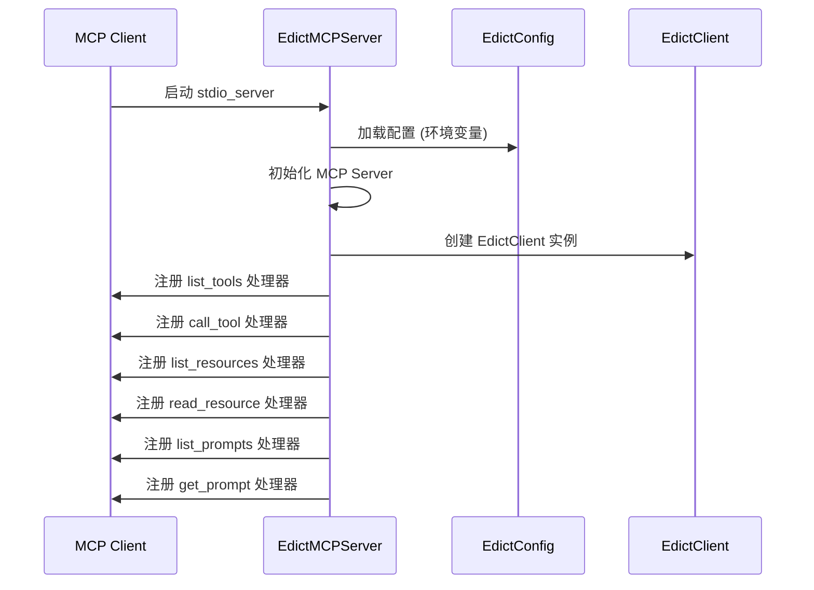
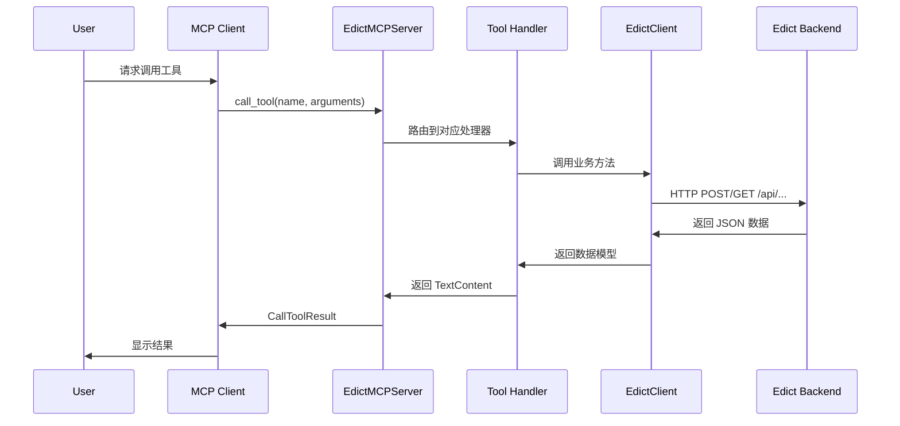

# Edict MCP

基于中国古代"三省六部"制度的 AI Agent 协作平台的 MCP (Model Context Protocol) 集成方案。

## 架构设计

### 系统架构图

```
┌─────────────────────────────────────────────────────────────┐
│                        MCP Client                            │
│                   (如 Claude Desktop)                        │
└─────────────────────────┬───────────────────────────────────┘
                          │ MCP Protocol (stdio)
┌─────────────────────────▼───────────────────────────────────┐
│                     EdictMCPServer                          │
│  ┌─────────────────────────────────────────────────────┐   │
│  │  Tools (8)  │  Resources (6)  │  Prompts (6)    │   │
│  └─────────────────────────────────────────────────────┘   │
│  ┌─────────────────────────────────────────────────────┐   │
│  │              EdictClient                            │   │
│  │         (httpx AsyncClient)                        │   │
│  └─────────────────────────────────────────────────────┘   │
└─────────────────────────┬───────────────────────────────────┘
                          │ HTTP REST API
┌─────────────────────────▼───────────────────────────────────┐
│                     Edict Backend                           │
│  ┌─────────────┐  ┌─────────────┐  ┌─────────────────┐   │
│  │   Agents    │  │   Tasks    │  │    Events       │   │
│  └─────────────┘  └─────────────┘  └─────────────────┘   │
└─────────────────────────────────────────────────────────────┘
```

### 核心组件

| 组件 | 文件 | 说明 |
|------|------|------|
| EdictMCPServer | server.py | MCP Server 主入口，整合 Tools/Resources/Prompts |
| EdictClient | client.py | HTTP 客户端，负责与 Edict Backend API 通信 |
| EdictConfig | config.py | 配置管理，支持环境变量 |
| Tools | tools/*.py | MCP 工具：Tasks/Agents/Events |
| Resources | resources/*.py | MCP 资源：系统状态/任务统计等 |
| Prompts | prompts/*.py | MCP 提示模板 |

## 核心工作流程

### 1. 服务器初始化流程



### 2. 工具调用流程



### 3. 客户端连接流程

```python
from edict_mcp import EdictClient
from edict_mcp.config import EdictConfig

# 方式1: 使用默认配置
async with EdictClient() as client:
    task = await client.create_task(title="新任务")
    print(task.id)

# 方式2: 自定义配置
config = EdictConfig(
    api_url="http://localhost:8000",
    api_timeout=30,
    max_retries=3
)
async with EdictClient(config) as client:
    agents = await client.list_agents()
    for agent in agents:
        print(agent.name)
```

## 配置方法

### 环境变量配置

| 环境变量 | 默认值 | 说明 |
|----------|--------|------|
| EDICT_API_URL | http://localhost:8000 | Edict API 地址 |
| EDICT_WS_URL | ws://localhost:8000 | WebSocket 地址 |
| EDICT_API_TIMEOUT | 30 | API 超时时间(秒) |
| EDICT_MAX_RETRIES | 3 | 最大重试次数 |
| EDICT_WS_RECONNECT_DELAY | 5 | WebSocket 重连延迟 |
| EDICT_WS_HEARTBEAT_INTERVAL | 30 | WebSocket 心跳间隔 |
| MCP_SERVER_NAME | edict | MCP 服务器名称 |
| MCP_SERVER_VERSION | 0.1.0 | MCP 服务器版本 |
| LOG_LEVEL | INFO | 日志级别 |

### 配置文件

创建 `.env` 文件:

```bash
EDICT_API_URL=http://localhost:8000
EDICT_API_TIMEOUT=30
EDICT_MAX_RETRIES=3
LOG_LEVEL=INFO
```

### 编程配置

```python
from edict_mcp.config import EdictConfig

config = EdictConfig(
    api_url="http://your-api-server:8000",
    api_timeout=60,
    max_retries=5,
    log_level="DEBUG"
)
```

## 工具列表

### 任务管理 Tools

| 工具名 | 说明 | 参数 |
|--------|------|------|
| create_task | 创建新任务 | title, description, priority |
| get_task | 获取任务详情 | task_id |
| list_tasks | 获取任务列表 | state, limit, offset |
| delete_task | 删除任务 | task_id |
| transition_task | 转换任务状态 | task_id, new_state, reason |
| dispatch_task | 派发任务给 Agent | task_id, agent_id, instruction |
| add_progress | 添加进度记录 | task_id, message |
| update_todos | 更新子任务 | task_id, todos |

### Agent 管理 Tools

| 工具名 | 说明 | 参数 |
|--------|------|------|
| list_agents | 获取 Agent 列表 | - |
| get_agent | 获取 Agent 详情 | agent_id |
| get_agent_config | 获取 Agent 配置 | agent_id |

### 事件查询 Tools

| 工具名 | 说明 | 参数 |
|--------|------|------|
| list_events | 获取事件列表 | topic, task_id, limit |
| list_topics | 获取事件主题列表 | - |
| get_stream_info | 获取 Stream 信息 | topic |

## 资源列表

| 资源 URI | 说明 |
|----------|------|
| edict://system/status | 系统状态 |
| edict://tasks/count | 任务统计 |
| edict://tasks/by-state | 按状态统计 |
| edict://agents/list | Agent 列表 |
| edict://task/{task_id} | 任务详情 |
| edict://agent/{agent_id} | Agent 详情 |

## 提示模板

| 提示名 | 说明 |
|--------|------|
| create_task | 创建任务提示 |
| task_status | 任务状态查询 |
| transition_task | 状态转换 |
| dispatch_to_agent | 任务派发 |
| list_all_tasks | 任务列表 |
| list_agents | Agent 列表 |

## 安装和使用

### 安装依赖

```bash
pip install -e .
```

### 运行 MCP Server

```bash
# 使用默认配置
edict-mcp

# 或通过 Python 运行
python -m edict_mcp.server
```

### 在 Claude Desktop 中使用

在 `claude_desktop_config.json` 中配置:

```json
{
  "mcpServers": {
    "edict": {
      "command": "edict-mcp",
      "env": {
        "EDICT_API_URL": "http://localhost:8000"
      }
    }
  }
}
```

## 开发

### 运行测试

```bash
cd kilo-edict-mcp
pip install -e ".[dev]"
pytest tests/ -v
```

### 代码规范

```bash
# 代码检查
ruff check src/

# 类型检查
mypy src/
```

## 许可证

MIT License
