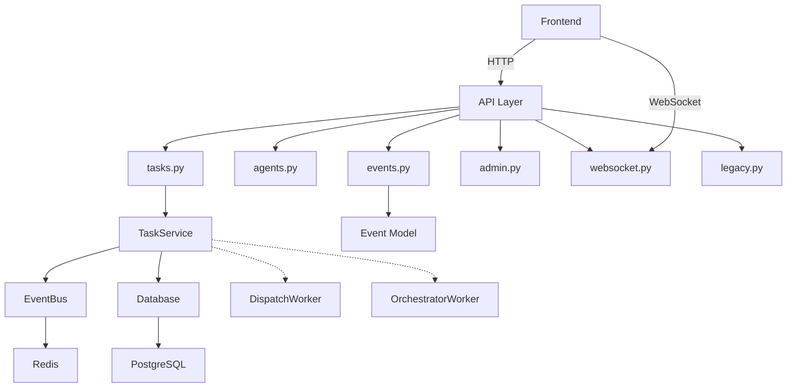

# Edict 后端 API 层分析报告

## 1. 概述

Edict 是一个基于 **FastAPI + PostgreSQL + Redis** 构建的事件驱动型 AI Agent 协作平台，采用"三省六部"中国古代官制隐喻作为任务流转状态机。API 层采用标准的 RESTful 风格，配合 WebSocket 实现实时推送。

## 2. API 端点清单

### 2.1 任务管理 API (`/api/tasks`)

| 路径 | 方法 | 功能 | 认证 |
|------|------|------|------|
| `/api/tasks` | GET | 获取任务列表（支持状态/组织/优先级过滤） | 无 |
| `/api/tasks/live-status` | GET | 获取兼容旧格式的全局实时状态 | 无 |
| `/api/tasks/stats` | GET | 获取任务统计（按状态分组计数） | 无 |
| `/api/tasks` | POST | 创建新任务 | 无 |
| `/api/tasks/{task_id}` | GET | 获取任务详情 | 无 |
| `/api/tasks/{task_id}/transition` | POST | 执行任务状态流转 | 无 |
| `/api/tasks/{task_id}/dispatch` | POST | 手动派发任务给指定 Agent | 无 |
| `/api/tasks/{task_id}/progress` | POST | 添加进度记录 | 无 |
| `/api/tasks/{task_id}/todos` | PUT | 更新任务 TODO 清单 | 无 |
| `/api/tasks/{task_id}/scheduler` | PUT | 更新任务排期信息 | 无 |

### 2.2 Agent 信息 API (`/api/agents`)

| 路径 | 方法 | 功能 | 认证 |
|------|------|------|------|
| `/api/agents` | GET | 列出所有可用 Agent | 无 |
| `/api/agents/{agent_id}` | GET | 获取 Agent 详情（含 SOUL.md 预览） | 无 |
| `/api/agents/{agent_id}/config` | 获取 Agent 运行时配置 | 无 |

### 2.3 事件查询 API (`/api/events`)

| 路径 | 方法 | 功能 | 认证 |
|------|------|------|------|
| `/api/events` | GET | 查询持久化事件（PostgreSQL） | 无 |
| `/api/events/stream-info` | GET | 查询 Redis Stream 实时信息 | 无 |
| `/api/events/topics` | GET | 列出所有可用事件 Topic | 无 |

### 2.4 管理 API (`/api/admin`)

| 路径 | 方法 | 功能 | 认证 |
|------|------|------|------|
| `/api/admin/health/deep` | GET | 深度健康检查（Postgres + Redis） | 无 |
| `/api/admin/pending-events` | GET | 查看未 ACK 的 pending 事件 | 无 |
| `/api/admin/migrate/check` | POST | 检查旧数据文件是否存在 | 无 |
| `/api/admin/config` | GET | 获取当前运行配置（脱敏） | 无 |

### 2.5 WebSocket 实时通信 (`/ws`)

| 路径 | 方法 | 功能 | 认证 |
|------|------|------|------|
| `/ws/ws` | WebSocket | 全局事件推送（订阅所有事件） | 无 |
| `/ws/ws/task/{task_id}` | WebSocket | 单任务事件推送（仅相关事件） | 无 |

### 2.6 旧版兼容 API (`/api/tasks`)

| 路径 | 方法 | 功能 | 认证 |
|------|------|------|------|
| `/api/tasks/by-legacy/{legacy_id}` | GET | 通过旧版 ID 获取任务 | 无 |
| `/api/tasks/by-legacy/{legacy_id}/transition` | POST | 旧版任务状态流转 | 无 |
| `/api/tasks/by-legacy/{legacy_id}/progress` | POST | 旧版任务添加进度 | 无 |
| `/api/tasks/by-legacy/{legacy_id}/todos` | PUT | 旧版任务更新 TODO | 无 |

## 3. 请求/响应格式规范

### 3.1 任务创建 (POST /api/tasks)

**请求体：**
```json
{
  "title": "string",
  "description": "string",
  "priority": "中",
  "assignee_org": "string | null",
  "creator": "emperor",
  "tags": ["string"],
  "meta": {}
}
```

**响应：**
```json
{
  "task_id": "uuid",
  "trace_id": "uuid",
  "state": "Taizi"
}
```

### 3.2 任务状态流转 (POST /api/tasks/{task_id}/transition)

**请求体：**
```json
{
  "new_state": "Zhongshu",
  "agent": "system",
  "reason": "string"
}
```

**响应：**
```json
{
  "task_id": "uuid",
  "state": "Zhongshu",
  "message": "ok"
}
```

### 3.3 任务派发 (POST /api/tasks/{task_id}/dispatch)

**查询参数：**
- `agent`: 目标 Agent ID
- `message`: 派发消息

**响应：**
```json
{
  "message": "dispatch requested",
  "agent": "zhongshu"
}
```

### 3.4 添加进度 (POST /api/tasks/{task_id}/progress)

**请求体：**
```json
{
  "agent": "zhongshu",
  "content": "进度描述"
}
```

### 3.5 事件查询 (GET /api/events)

**查询参数：**
- `trace_id`: 关联任务 ID（可选）
- `topic`: 事件主题（可选）
- `producer`: 事件生产者（可选）
- `limit`: 返回数量（默认 50，最大 500）

**响应：**
```json
{
  "events": [
    {
      "event_id": "uuid",
      "trace_id": "string",
      "topic": "task.created",
      "event_type": "string",
      "producer": "task_service",
      "payload": {},
      "meta": {},
      "timestamp": "ISO8601"
    }
  ],
  "count": 50
}
```

### 3.6 WebSocket 消息格式

**服务端推送：**
```json
{
  "type": "event",
  "topic": "task.status",
  "data": {
    "event_id": "uuid",
    "trace_id": "string",
    "topic": "task.status",
    "event_type": "task.state.Zhongshu",
    "producer": "system",
    "payload": {},
    "meta": {},
    "timestamp": "ISO8601"
  }
}
```

**客户端消息：**
- `ping` / `pong`: 心跳
- `subscribe`: 订阅特定 topic

## 4. 认证授权机制

### 当前状态
**无认证授权机制** - 所有 API 端点均无认证保护：
- 无 API Key 验证
- 无 JWT Token
- 无 OAuth2
- CORS 配置为允许所有来源 (`allow_origins=["*"]`)

### 安全建议
如需生产环境部署，应考虑：
1. 添加 API Key 或 JWT 认证
2. 限制 CORS 白名单
3. 敏感操作（如状态流转）添加权限校验

## 5. 错误处理机制

### HTTP 状态码使用
- `200 OK`: 成功
- `201 Created`: 资源创建成功
- `400 Bad Request`: 请求参数错误（如无效状态值）
- `404 Not Found`: 资源不存在

### 错误响应格式
```json
{
  "detail": "Task not found"
}
```

### 主要异常处理
1. **ValueError**: 无效状态流转（400）
2. **任务未找到**: 404
3. **数据库异常**: 自动回滚

## 6. 事件主题 (Event Topics)

| Topic | 描述 | 用途 |
|-------|------|------|
| `task.created` | 任务创建 | 触发后续流程 |
| `task.planning.request` | 规划请求 | 中书省介入 |
| `task.planning.complete` | 规划完成 | 门下省审议 |
| `task.review.request` | 审查请求 | 六部完成 |
| `task.review.result` | 审查结果 | 尚书省汇总 |
| `task.dispatch` | 任务派发 | Agent 消费 |
| `task.status` | 状态变更 | WebSocket 推送 |
| `task.completed` | 任务完成 | 终态 |
| `task.closed` | 任务关闭 | 归档 |
| `task.replan` | 任务重规划 | 阻塞恢复 |
| `task.stalled` | 任务停滞 | 调度器检测 |
| `task.escalated` | 任务升级 | 人工介入 |
| `agent.thoughts` | Agent 思考流 | 实时展示 |
| `agent.todo.update` | Agent TODO 更新 | 同步状态 |
| `agent.heartbeat` | Agent 心跳 | 存活检测 |

## 7. 任务状态机

### 状态枚举
- `Taizi` - 太子分拣
- `Zhongshu` - 中书省起草
- `Menxia` - 门下省审议
- `Assigned` - 尚书省派发
- `Next` - 待执行
- `Doing` - 六部执行中
- `Review` - 审查汇总
- `Done` - 完成
- `Blocked` - 阻塞
- `Cancelled` - 取消
- `Pending` - 待处理

### 状态流转规则
```
Taizi → Zhongshu → Menxia → Assigned → Doing → Review → Done
  ↓       ↓          ↓           ↓          ↓        ↓
  └──────→ Cancelled ←──────────┴──────────┴────────┘
  ↓                     ↓                    ↓
  └────────────────────→ Blocked ──────────→（可回退任意状态）
```

## 8. 模块依赖关系



### 依赖详情

- **tasks.py**: 依赖 `db.py`, `models/task.py`, `services/event_bus.py`, `services/task_service.py`
- **agents.py**: 无服务依赖（纯静态配置 + 文件读取）
- **events.py**: 依赖 `db.py`, `models/event.py`, `services/event_bus.py`
- **admin.py**: 依赖 `db.py`, `services/event_bus.py`
- **websocket.py**: 依赖 `config.py`, `services/event_bus.py`
- **legacy.py**: 依赖 `db.py`, `models/task.py`, `services/event_bus.py`, `services/task_service.py`

## 9. MCP 集成建议

### 9.1 推荐的 MCP 集成端点

#### 核心任务操作
1. **创建任务** - `POST /api/tasks`
   - 用途：MCP 工具可创建新任务
   - 建议封装为 `edict_create_task` 工具

2. **状态流转** - `POST /api/tasks/{task_id}/transition`
   - 用途：推动任务在不同部门间流转
   - 建议封装为 `edict_transition_task` 工具

3. **任务派发** - `POST /api/tasks/{task_id}/dispatch`
   - 用途：将任务分配给特定 Agent 处理
   - 建议封装为 `edict_dispatch_task` 工具

4. **获取任务** - `GET /api/tasks/{task_id}`
   - 用途：查询任务当前状态和详情
   - 建议封装为 `edict_get_task` 工具

5. **任务列表** - `GET /api/tasks`
   - 用途：按状态/组织过滤查询任务
   - 建议封装为 `edict_list_tasks` 工具

#### Agent 信息查询
6. **Agent 列表** - `GET /api/agents`
   - 用途：获取所有可用 Agent
   - 建议封装为 `edict_list_agents` 工具

7. **Agent 配置** - `GET /api/agents/{agent_id}/config`
   - 用途：获取特定 Agent 运行时配置
   - 建议封装为 `edict_get_agent_config` 工具

#### 事件监控
8. **事件查询** - `GET /api/events`
   - 用途：查询历史事件用于审计
   - 建议封装为 `edict_query_events` 工具

9. **WebSocket** - `/ws/ws`
   - 用途：实时接收任务状态变更、Agent 思考流
   - 建议封装为 `edict_subscribe_events` 工具

#### 管理功能
10. **健康检查** - `GET /api/admin/health/deep`
    - 用途：检查后端服务状态
    - 建议封装为 `edict_health_check` 工具

### 9.2 MCP 工具封装示例

```python
# MCP 工具定义示例
edict_create_task = {
    "name": "edict_create_task",
    "description": "创建一个新任务",
    "inputSchema": {
        "type": "object",
        "properties": {
            "title": {"type": "string", "description": "任务标题"},
            "description": {"type": "string", "description": "任务描述"},
            "priority": {"type": "string", "enum": ["高", "中", "低"], "default": "中"},
            "assignee_org": {"type": "string", "description": "目标部门"}
        },
        "required": ["title"]
    }
}

edict_transition_task = {
    "name": "edict_transition_task",
    "description": "执行任务状态流转",
    "inputSchema": {
        "type": "object",
        "properties": {
            "task_id": {"type": "string", "description": "任务 ID"},
            "new_state": {"type": "string", "enum": ["Taizi", "Zhongshu", "Menxia", "Assigned", "Doing", "Review", "Done", "Blocked", "Cancelled"]},
            "agent": {"type": "string", "description": "执行者"},
            "reason": {"type": "string", "description": "流转原因"}
        },
        "required": ["task_id", "new_state"]
    }
}
```

### 9.3 注意事项

1. **无认证保护**：当前所有端点均无认证，MCP 集成需注意安全问题
2. **WebSocket 持久连接**：实时推送需要维护长连接
3. **状态机约束**：状态流转必须遵循 STATE_TRANSITIONS 规则
4. **事件驱动架构**：任务流转会触发事件，可被下游 Worker 消费

## 10. 总结

Edict 后端 API 层设计简洁清晰，采用：
- **FastAPI** 框架，代码简洁易维护
- **PostgreSQL** + **Redis** 双存储，兼顾持久化和实时性
- **事件驱动架构**，通过 Redis Stream 实现可靠的异步任务派发
- **WebSocket** 替代 HTTP 轮询，实现真正的实时推送
- **无认证设计**，适合内部工具/MCP 集成场景

API 覆盖了任务全生命周期管理、部门协作、事件审计等核心功能，为 MCP 集成提供了丰富的工具接口。

---
*报告生成时间: 2026-03-10*
*分析范围: edict/backend/app/api/*
