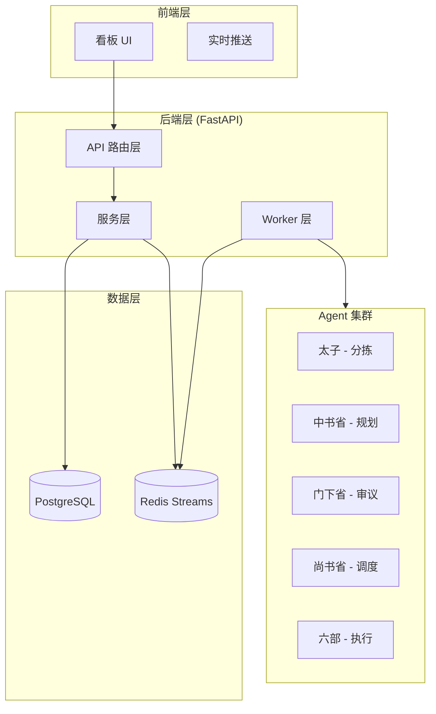
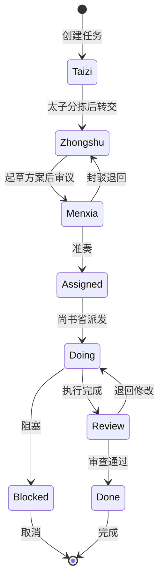
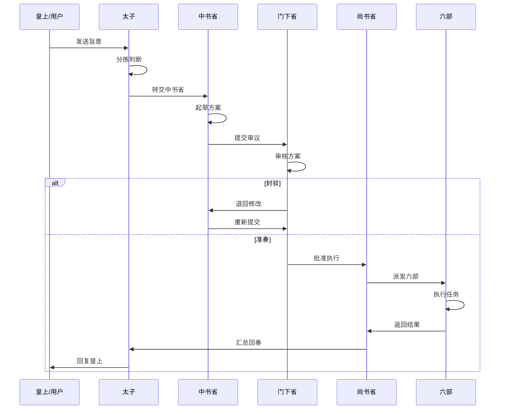
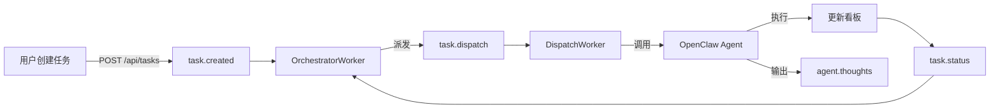
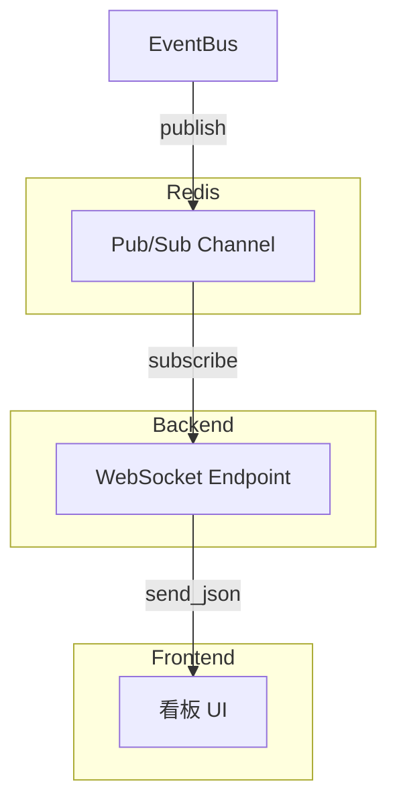
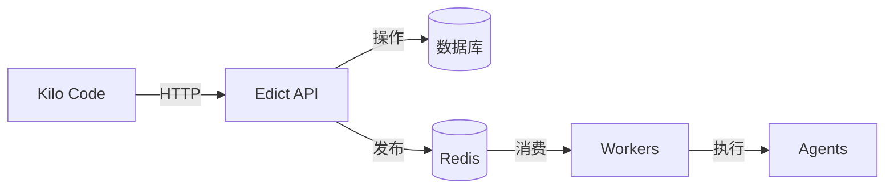
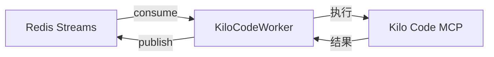
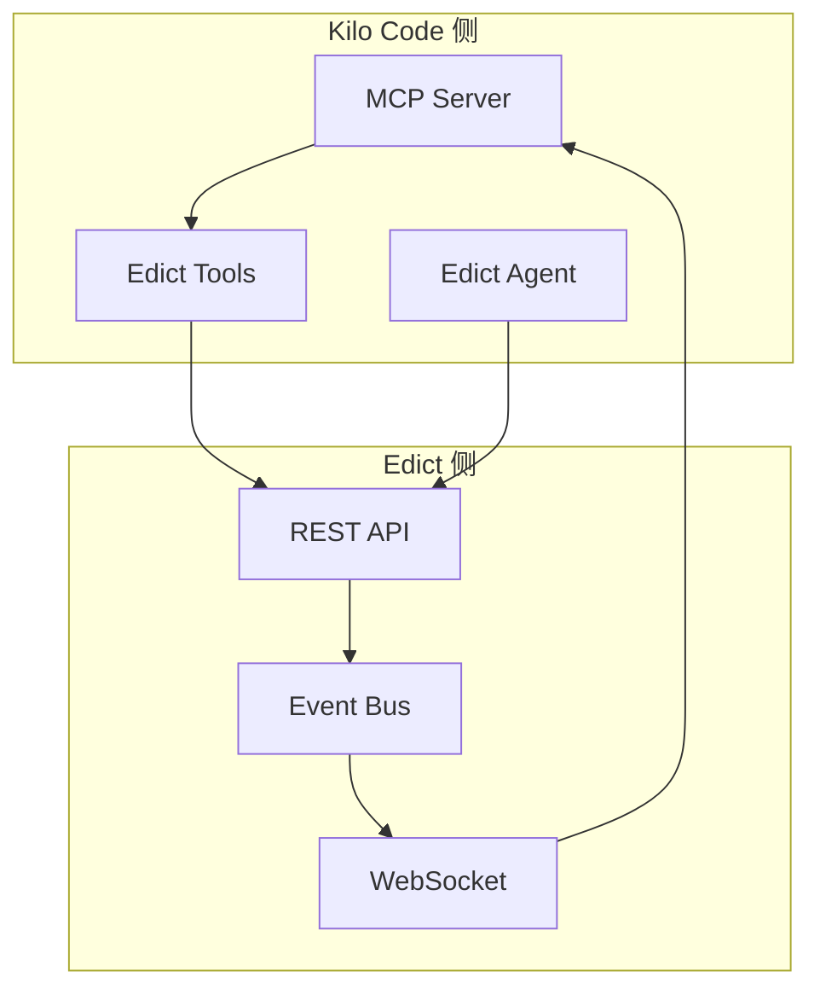

# Edict 项目架构分析报告

## 1. 系统整体架构

Edict 是一个基于"三省六部"概念的 AI Agent 协作平台，采用事件驱动架构，通过任务状态机驱动多个专业 Agent 协作完成任务。

### 1.1 核心组件架构图



---

## 2. API 层分析

### 2.1 路由结构

| 路由模块 | 路径前缀 | 核心功能 |
|---------|---------|---------|
| `tasks.py` | `/api/tasks` | 任务 CRUD、状态流转、派发 |
| `agents.py` | `/api/agents` | Agent 元信息查询、SOUL 预览 |
| `events.py` | `/api/events` | 事件查询、Stream 信息 |
| `websocket.py` | `/ws` | 实时事件推送 |
| `admin.py` | `/api/admin` | 健康检查、配置查询 |
| `legacy.py` | `/api/tasks` | 旧版 ID 兼容 |

### 2.2 任务状态流转 API



### 2.3 关键端点列表

```python
# 任务管理
GET    /api/tasks              # 任务列表
POST   /api/tasks              # 创建任务
GET    /api/tasks/{id}         # 任务详情
POST   /api/tasks/{id}/transition   # 状态流转
POST   /api/tasks/{id}/dispatch     # 手动派发
POST   /api/tasks/{id}/progress     # 添加进度

# Agent 信息
GET    /api/agents             # Agent 列表
GET    /api/agents/{id}        # Agent 详情
GET    /api/agents/{id}/config # Agent 配置

# 事件系统
GET    /api/events             # 事件查询
GET    /api/events/topics      # Topic 列表
GET    /api/events/stream-info # Stream 信息

# WebSocket
WS     /ws                     # 全局事件流
WS     /ws/task/{task_id}      # 单任务事件流
```

---

## 3. 服务层分析

### 3.1 TaskService - 任务核心服务

**位置**: [`edict/backend/app/services/task_service.py`](edict/backend/app/services/task_service.py)

| 方法 | 功能 | 触发事件 |
|------|------|---------|
| `create_task()` | 创建任务 | `task.created` |
| `transition_state()` | 状态流转 | `task.status` / `task.completed` |
| `request_dispatch()` | 请求派发 | `task.dispatch` |
| `add_progress()` | 添加进度 | - |
| `update_todos()` | 更新 TODO | - |

### 3.2 EventBus - 事件总线服务

**位置**: [`edict/backend/app/services/event_bus.py`](edict/backend/app/services/event_bus.py)

**核心特性**:
- 基于 **Redis Streams** 实现可靠消息队列
- 支持消费者组（Consumer Group）和 ACK 机制
- 自动重投递未 ACK 的消息（崩溃恢复）
- 双通道推送：Stream（持久化）+ Pub/Sub（实时）

**标准 Topics**:

```python
TOPIC_TASK_CREATED = "task.created"          # 任务创建
TOPIC_TASK_DISPATCH = "task.dispatch"        # 任务派发
TOPIC_TASK_STATUS = "task.status"            # 状态变更
TOPIC_TASK_COMPLETED = "task.completed"      # 任务完成
TOPIC_TASK_STALLED = "task.stalled"          # 任务停滞
TOPIC_AGENT_THOUGHTS = "agent.thoughts"      # Agent 思考
TOPIC_AGENT_HEARTBEAT = "agent.heartbeat"    # Agent 心跳
```

---

## 4. 数据模型分析

### 4.1 Task 模型 - 任务核心表

**位置**: [`edict/backend/app/models/task.py`](edict/backend/app/models/task.py)

| 字段 | 类型 | 说明 |
|------|------|------|
| `id` | String(32) | 任务 ID，如 JJC-20260301-001 |
| `title` | Text | 任务标题 |
| `state` | Enum | 状态: Taizi/Zhongshu/Menxia/Assigned/Doing/Review/Done/Blocked |
| `org` | String(32) | 当前执行部门 |
| `official` | String(32) | 责任官员 |
| `flow_log` | JSONB | 流转日志 [{at, from, to, remark}] |
| `progress_log` | JSONB | 进展日志 [{at, agent, text, todos}] |
| `todos` | JSONB | 子任务列表 |
| `scheduler` | JSONB | 调度器元数据 |

**状态流转规则**:

```python
STATE_TRANSITIONS = {
    TaskState.Taizi: {TaskState.Zhongshu, TaskState.Cancelled},
    TaskState.Zhongshu: {TaskState.Menxia, TaskState.Cancelled, TaskState.Blocked},
    TaskState.Menxia: {TaskState.Assigned, TaskState.Zhongshu, TaskState.Cancelled},
    TaskState.Assigned: {TaskState.Doing, TaskState.Next, TaskState.Cancelled, TaskState.Blocked},
    TaskState.Doing: {TaskState.Review, TaskState.Done, TaskState.Blocked, TaskState.Cancelled},
    TaskState.Review: {TaskState.Done, TaskState.Doing, TaskState.Cancelled},
    TaskState.Blocked: {TaskState.Taizi, TaskState.Zhongshu, TaskState.Menxia, TaskState.Assigned, TaskState.Doing},
}
```

### 4.2 Event 模型 - 事件持久化

**位置**: [`edict/backend/app/models/event.py`](edict/backend/app/models/event.py)

```python
class Event(Base):
    event_id: UUID      # 事件唯一 ID
    trace_id: String    # 关联任务 ID
    topic: String       # 事件主题
    event_type: String  # 事件类型
    producer: String    # 生产者
    payload: JSONB      # 事件负载
    meta: JSONB         # 元数据
    timestamp: DateTime # 时间戳
```

### 4.3 Thought 模型 - Agent 思考流

**位置**: [`edict/backend/app/models/thought.py`](edict/backend/app/models/thought.py)

```python
class Thought(Base):
    thought_id: UUID
    trace_id: String    # 关联任务
    agent: String       # Agent 标识
    step: Integer       # 思考步骤
    type: String        # reasoning|query|action_intent|summary
    content: Text       # 思考内容
    confidence: Float   # 置信度
```

---

## 5. Worker 层分析

### 5.1 OrchestratorWorker - 编排器

**位置**: [`edict/backend/app/workers/orchestrator_worker.py`](edict/backend/app/workers/orchestrator_worker.py)

**职责**:
- 监听 `task.created` → 自动派发给太子
- 监听 `task.status` → 根据新状态派发对应 Agent
- 监听 `task.completed` → 记录日志
- 监听 `task.stalled` → 处理停滞任务

**自动派发映射**:

```python
STATE_AGENT_MAP = {
    TaskState.Taizi: "taizi",
    TaskState.Zhongshu: "zhongshu",
    TaskState.Menxia: "menxia",
    TaskState.Assigned: "shangshu",
    TaskState.Review: "shangshu",
}

ORG_AGENT_MAP = {
    "户部": "hubu",
    "礼部": "libu",
    "兵部": "bingbu",
    "刑部": "xingbu",
    "工部": "gongbu",
    "吏部": "libu_hr",
}
```

### 5.2 DispatchWorker - 派发执行器

**位置**: [`edict/backend/app/workers/dispatch_worker.py`](edict/backend/app/workers/dispatch_worker.py)

**核心功能**:
- 消费 `task.dispatch` 事件
- 调用 OpenClaw CLI 执行 Agent: `openclaw agent --agent xxx -m "..."`
- 发布 Agent 输出到 `agent.thoughts`
- ACK 确认机制保证不丢失

**环境变量传递**:
```bash
EDICT_TASK_ID={task_id}
EDICT_TRACE_ID={trace_id}
EDICT_API_URL=http://localhost:{port}
```

---

## 6. Agent 配置分析

### 6.1 Agent 职责矩阵

| Agent | 职责 | 工作模式 |
|-------|------|---------|
| **太子 (taizi)** | 消息分拣、任务创建、皇上代理 | 常驻会话 |
| **中书省 (zhongshu)** | 方案起草、规划决策 | Subagent |
| **门下省 (menxia)** | 方案审议、封驳/准奏 | Subagent |
| **尚书省 (shangshu)** | 任务调度、派发六部 | Subagent |
| **工部 (gongbu)** | 代码开发、架构设计 | Subagent |
| **礼部 (libu)** | 文档、UI、对外沟通 | Subagent |
| **户部 (hubu)** | 数据分析、统计报表 | Subagent |
| **兵部 (bingbu)** | 基础设施、部署运维 | Subagent |
| **刑部 (xingbu)** | 代码审查、测试验收 | Subagent |
| **吏部 (libu_hr)** | Agent 管理、技能培训 | Subagent |
| **早朝 (zaochao)** | 每日简报生成 | 定时任务 |

### 6.2 Agent 协作流程



---

## 7. 看板服务器分析

### 7.1 Dashboard Server 架构

**位置**: [`dashboard/server.py`](dashboard/server.py)

**核心特性**:
- 基于 `http.server.BaseHTTPRequestHandler` 的轻量级 HTTP 服务器
- 端口默认: 7891
- 同时提供 REST API 和静态文件服务

### 7.2 关键 API 端点

```python
# 任务管理
GET  /api/live-status           # 获取任务状态
POST /api/task-action           # 停止/取消/恢复任务
POST /api/archive-task          # 归档任务
POST /api/advance-state         # 手动推进状态
POST /api/create-task           # 创建新任务
POST /api/review-action         # 门下省御批

# Agent 管理
GET  /api/agents-status         # Agent 在线状态
POST /api/wake-agent            # 唤醒 Agent
GET  /api/agent-activity        # Agent 活动记录

# Skill 管理
GET  /api/agent/{id}/skills     # Agent Skills
POST /api/agent/{id}/skills     # 添加 Skill
POST /api/remote-skills         # 远程 Skills

# 调度器
GET  /api/scheduler-state       # 调度器状态
POST /api/scheduler-retry       # 重试任务
POST /api/scheduler-escalate    # 升级任务
POST /api/scheduler-scan        # 扫描停滞任务
```

### 7.3 数据存储

```
data/
├── tasks_source.json      # 任务数据源
├── live_status.json       # 实时状态缓存
├── agent_config.json      # Agent 配置
├── officials_stats.json   # 官员统计
└── morning_brief.json     # 早朝简报
```

---

## 8. 事件流转机制

### 8.1 任务生命周期事件流



### 8.2 WebSocket 实时推送



---

## 9. Kilo Code 子代理集成方案建议

### 9.1 集成点分析

基于架构分析，Kilo Code 可以通过以下方式集成 Edict：

#### 方案 A: API 调用模式



**适用场景**:
- 任务创建和管理
- 状态查询
- 进度跟踪

**核心端点**:
```python
# Kilo Code 调用 Edict API
POST /api/tasks              # 创建任务
GET  /api/tasks/{id}         # 查询任务
POST /api/tasks/{id}/transition  # 状态流转
WS   /ws/task/{id}           # 实时监听
```

#### 方案 B: Agent 代理模式


**适用场景**:
- 复杂任务需要多 Agent 协作
- 需要利用现有工作流
- 保持与传统 Agent 一致的体验

#### 方案 C: Worker 扩展模式



**适用场景**:
- 需要自定义执行逻辑
- 与现有 Worker 并行运行
- 完全控制任务执行过程

### 9.2 推荐集成架构



### 9.3 实施建议

1. **第一阶段**: 实现基础 API 调用封装
   - 任务 CRUD 操作
   - 状态流转控制
   - 事件监听

2. **第二阶段**: 实现 Agent 工作流集成
   - 作为特殊 Agent 接入
   - 支持 subagent 调用
   - 参与状态机流转

3. **第三阶段**: 自定义 Worker 扩展
   - 实现 KiloCodeWorker
   - 支持复杂任务执行
   - 双向状态同步

---

## 10. 总结

### 10.1 架构优势

1. **事件驱动**: Redis Streams 保证可靠消息传递
2. **状态机清晰**: 三省六部流程明确，职责分离
3. **可观测性强**: Event + Thought + Progress 全链路追踪
4. **扩展性好**: Worker + Agent 模式支持水平扩展

### 10.2 集成关键点

| 组件 | 集成方式 | 复杂度 |
|------|---------|--------|
| Task API | HTTP 调用 | 低 |
| Event Bus | Redis 消费 | 中 |
| WebSocket | 实时监听 | 中 |
| Agent 接入 | Subagent 协议 | 高 |
| Worker 扩展 | 自定义 Worker | 高 |

### 10.3 注意事项

1. **ID 格式**: 旧版使用 `JJC-YYYYMMDD-NNN`，新版使用 UUID
2. **状态流转**: 必须遵循 `STATE_TRANSITIONS` 定义的合法路径
3. **看板更新**: Agent 通过 `kanban_update.py` CLI 更新状态
4. **ACK 机制**: Worker 消费事件后必须 ACK，否则会被重新投递
