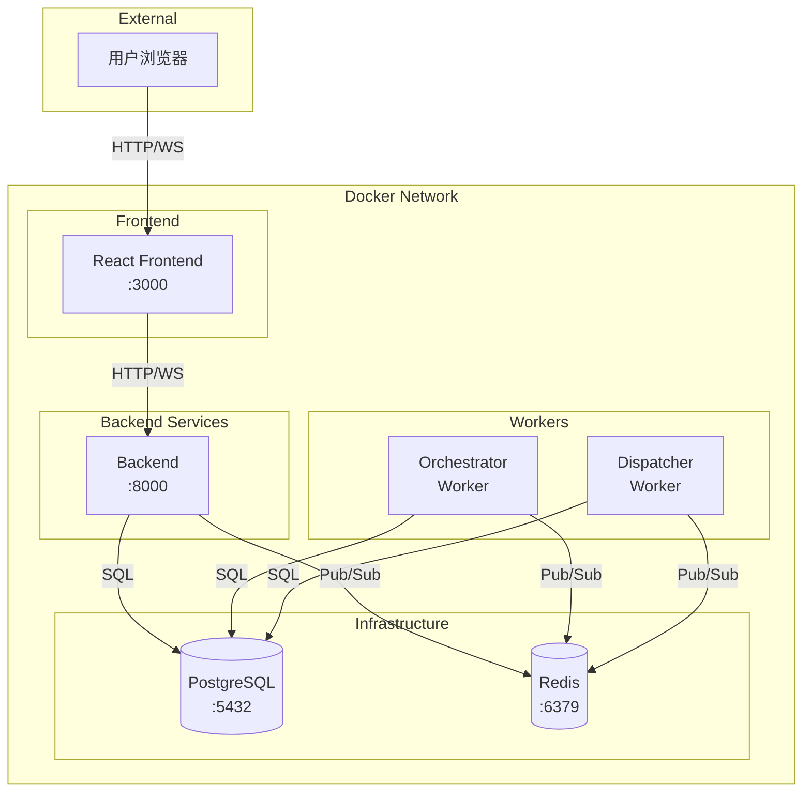
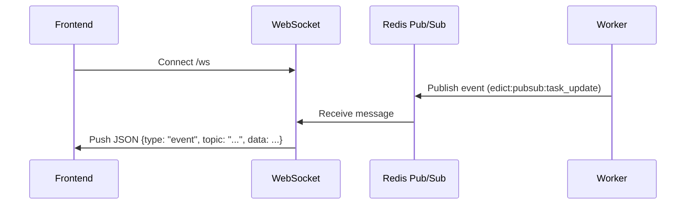
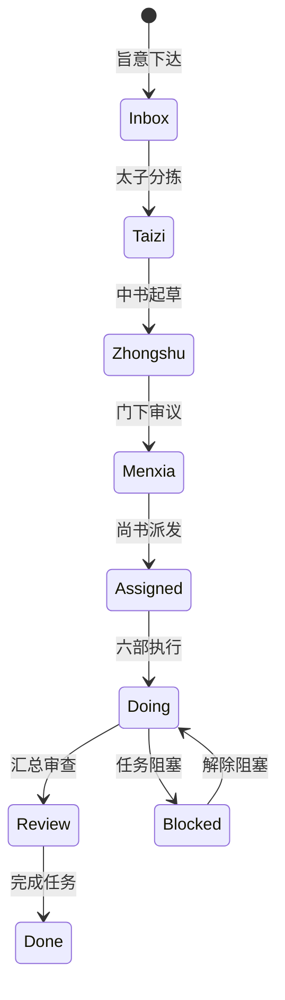
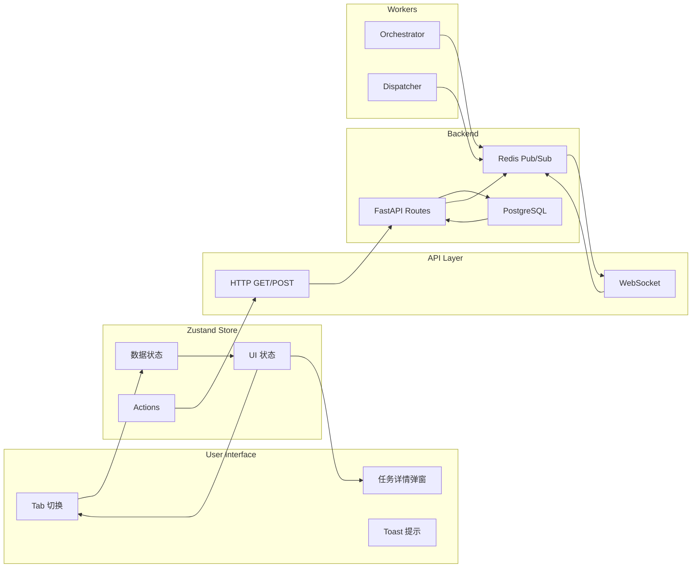

# Edict 项目配置、Docker 和前端代码分析报告

## 一、Docker 服务架构分析

### 1.1 顶层 Demo 配置

**文件**: [`docker-compose.yml`](docker-compose.yml:1)

```yaml
services:
  sansheng-demo:
    image: cft0808/sansheng-demo:latest
    platform: linux/amd64
    ports:
      - "7891:7891"
    environment:
      - DEMO_MODE=true
    restart: unless-stopped
```

**分析**:
- 这是一个简化的演示配置，仅包含单个服务
- 使用预构建的 Docker 镜像 `cft0808/sansheng-demo:latest`
- 端口映射: 7891 (外部) → 7891 (容器内部)
- 设置 `DEMO_MODE=true` 环境变量用于演示模式

### 1.2 完整服务配置

**文件**: [`edict/docker-compose.yml`](edict/docker-compose.yml:1)



**服务详解**:

| 服务名称 | 镜像/构建 | 端口 | 功能描述 |
|---------|----------|------|----------|
| `postgres` | postgres:16-alpine | 5432 | 主数据库，存储任务、事件等数据 |
| `redis` | redis:7-alpine | 6379 | 缓存 + 消息队列 + Pub/Sub |
| `backend` | edict/Dockerfile | 8000 | FastAPI 后端服务 |
| `orchestrator` | edict/Dockerfile | - | 任务编排 Worker |
| `dispatcher` | edict/Dockerfile | - | 任务分发 Worker |
| `frontend` | edict/frontend/Dockerfile | 3000 | React 前端 |

**端口映射汇总**:

| 服务 | 容器端口 | 主机端口 | 协议 |
|------|---------|---------|------|
| PostgreSQL | 5432 | 5432 | TCP |
| Redis | 6379 | 6379 | TCP |
| Backend | 8000 | 8000 | HTTP |
| Frontend | 3000 | 3000 | HTTP |

### 1.3 服务依赖关系

**依赖链**:
```
backend → postgres (健康检查) + redis (健康检查)
orchestrator → postgres + redis
dispatcher → postgres + redis
frontend → backend
```

**启动顺序**:
1. 基础设施层 (postgres, redis) 启动并通过健康检查
2. 后端服务 (backend) 依赖健康检查通过
3. Worker 服务 (orchestrator, dispatcher) 依赖健康检查通过
4. 前端服务 (frontend) 依赖后端服务

---

## 二、环境变量配置分析

### 2.1 环境变量清单

**文件**: [`edict/.env.example`](edict/.env.example:1)

| 变量分类 | 变量名 | 默认值 | 说明 |
|---------|-------|-------|------|
| **Postgres** | POSTGRES_HOST | localhost | 数据库主机 |
| | POSTGRES_PORT | 5432 | 数据库端口 |
| | POSTGRES_DB | edict | 数据库名称 |
| | POSTGRES_USER | edict | 数据库用户 |
| | POSTGRES_PASSWORD | edict_secret_change_me | 数据库密码 |
| **Redis** | REDIS_URL | redis://localhost:6379/0 | Redis 连接 URL |
| **Backend** | BACKEND_HOST | 0.0.0.0 | 监听地址 |
| | BACKEND_PORT | 8000 | 监听端口 |
| | SECRET_KEY | change-me-in-production | 密钥 |
| | DEBUG | true | 调试模式 |
| **OpenClaw** | OPENCLAW_GATEWAY_URL | http://localhost:18789 | OpenClaw 网关地址 |
| | OPENCLAW_BIN | openclaw | 可执行文件路径 |
| **Legacy** | LEGACY_DATA_DIR | ../data | 旧数据目录 |
| | LEGACY_TASKS_FILE | ../data/tasks_source.json | 旧任务文件 |
| **调度参数** | STALL_THRESHOLD_SEC | 180 | 任务停滞阈值(秒) |
| | MAX_DISPATCH_RETRY | 3 | 最大重试次数 |
| | DISPATCH_TIMEOUT_SEC | 300 | 分发超时(秒) |
| | HEARTBEAT_INTERVAL_SEC | 30 | 心跳间隔(秒) |
| **飞书** | FEISHU_DELIVER | true | 启用飞书通知 |
| | FEISHU_CHANNEL | feishu | 飞书频道 |

### 2.2 后端配置类

**文件**: [`edict/backend/app/config.py`](edict/backend/app/config.py:1)

```python
class Settings(BaseSettings):
    # 数据库配置
    postgres_host: str = "localhost"
    postgres_port: int = 5432
    postgres_db: str = "edict"
    postgres_user: str = "edict"
    postgres_password: str = "edict_secret_change_me"
    database_url_override: str | None = None
    
    # 计算属性
    @property
    def database_url(self) -> str:
        if self.database_url_override:
            return self.database_url_override
        return f"postgresql+asyncpg://{self.postgres_user}:{self.postgres_password}@{self.postgres_host}:{self.postgres_port}/{self.postgres_db}"
```

**配置加载流程**:
1. 使用 Pydantic Settings 从环境变量加载
2. 支持 `.env` 文件 (通过 `env_file=".env"`)
3. 使用 `@lru_cache` 单例模式缓存配置

### 2.3 Docker Compose 环境变量

**在 docker-compose.yml 中的环境变量**:

| 服务 | 环境变量 |
|------|---------|
| backend | DATABASE_URL, REDIS_URL, PORT, DEBUG |
| orchestrator | DATABASE_URL, REDIS_URL |
| dispatcher | DATABASE_URL, REDIS_URL, OPENCLAW_PROJECT_DIR |
| frontend | VITE_API_URL, VITE_WS_URL |

---

## 三、前端与后端通信分析

### 3.1 API 基础配置

**文件**: [`edict/frontend/src/api.ts`](edict/frontend/src/api.ts:1)

```typescript
const API_BASE = import.meta.env.VITE_API_URL || '';
```

**环境配置**:

| 环境 | VITE_API_URL | 说明 |
|------|-------------|------|
| 开发环境 | http://127.0.0.1:7891 | 见 [`edict/frontend/.env.development`](edict/frontend/.env.development:1) |
| 生产环境 | (空字符串) | 同源请求 |

### 3.2 HTTP 通信层

**请求方法**:

```typescript
// GET 请求
async function fetchJ<T>(url: string): Promise<T> {
  const res = await fetch(url, { cache: 'no-store' });
  if (!res.ok) throw new Error(String(res.status));
  return res.json();
}

// POST 请求
async function postJ<T>(url: string, data: unknown): Promise<T> {
  const res = await fetch(url, {
    method: 'POST',
    headers: { 'Content-Type': 'application/json' },
    body: JSON.stringify(data),
  });
  return res.json();
}
```

### 3.3 API 接口分类

**核心数据接口**:

| 方法 | 端点 | 返回类型 | 说明 |
|-----|------|---------|------|
| GET | `/api/live-status` | LiveStatus | 实时任务状态 |
| GET | `/api/agent-config` | AgentConfig | Agent 配置信息 |
| GET | `/api/model-change-log` | ChangeLogEntry[] | 模型变更日志 |
| GET | `/api/officials-stats` | OfficialsData | 官员统计数据 |
| GET | `/api/morning-brief` | MorningBrief | 早报内容 |
| GET | `/api/agents-status` | AgentsStatusData | Agent 状态 |

**操作类接口**:

| 方法 | 端点 | 功能 |
|-----|------|------|
| POST | `/api/set-model` | 设置 Agent 模型 |
| POST | `/api/agent-wake` | 唤醒 Agent |
| POST | `/api/task-action` | 执行任务动作 |
| POST | `/api/review-action` | 审查操作 |
| POST | `/api/advance-state` | 推进任务状态 |
| POST | `/api/scheduler-scan` | 扫描停滞任务 |
| POST | `/api/scheduler-retry` | 重试失败任务 |
| POST | `/api/scheduler-escalate` | 升级任务 |
| POST | `/api/scheduler-rollback` | 回滚任务 |

### 3.4 WebSocket 实时通信

**文件**: [`edict/backend/app/api/websocket.py`](edict/backend/app/api/websocket.py:1)

**WebSocket 端点**:

| 端点 | 功能 |
|------|------|
| `/ws` | 通用事件推送 |
| `/ws/task/{task_id}` | 单任务事件推送 |

**事件推送架构**:



**消息格式**:

```json
// 服务端推送
{
  "type": "event",
  "topic": "task_update",
  "data": { ... }
}

// 客户端心跳
{ "type": "ping" }

// 服务端响应
{ "type": "pong" }
```

---

## 四、前端数据流与状态管理

### 4.1 状态管理架构

**文件**: [`edict/frontend/src/store.ts`](edict/frontend/src/store.ts:1)

使用 **Zustand** 进行状态管理:

```typescript
interface AppStore {
  // 数据
  liveStatus: LiveStatus | null;
  agentConfig: AgentConfig | null;
  changeLog: ChangeLogEntry[];
  officialsData: OfficialsData | null;
  agentsStatusData: AgentsStatusData | null;
  morningBrief: MorningBrief | null;
  subConfig: SubConfig | null;
  
  // UI 状态
  activeTab: TabKey;
  edictFilter: 'active' | 'archived' | 'all';
  modalTaskId: string | null;
  
  // 操作
  loadLive: () => Promise<void>;
  loadAgentConfig: () => Promise<void>;
  // ...
}
```

### 4.2 数据加载流程

**文件**: [`edict/frontend/src/App.tsx`](edict/frontend/src/App.tsx:1)

```typescript
useEffect(() => {
  startPolling();
  return () => stopPolling();
}, []);
```

**轮询机制** (5秒间隔):

```typescript
export function startPolling() {
  if (_cdTimer) return;
  useStore.getState().loadAll();
  _cdTimer = setInterval(() => {
    const s = useStore.getState();
    const cd = s.countdown - 1;
    if (cd <= 0) {
      s.setCountdown(5);
      s.loadAll();  // 刷新所有数据
    } else {
      s.setCountdown(cd);
    }
  }, 1000);
}
```

### 4.3 看板 Pipeline 定义

**状态流转**:



**Pipeline 配置** (store.ts:21):

```typescript
export const PIPE = [
  { key: 'Inbox',    dept: '皇上',   icon: '👑', action: '下旨' },
  { key: 'Taizi',    dept: '太子',   icon: '🤴', action: '分拣' },
  { key: 'Zhongshu', dept: '中书省', icon: '📜', action: '起草' },
  { key: 'Menxia',   dept: '门下省', icon: '🔍', action: '审议' },
  { key: 'Assigned', dept: '尚书省', icon: '📮', action: '派发' },
  { key: 'Doing',    dept: '六部',   icon: '⚙️', action: '执行' },
  { key: 'Review',   dept: '尚书省', icon: '🔎', action: '汇总' },
  { key: 'Done',     dept: '回奏',   icon: '✅', action: '完成' },
] as const;
```

### 4.4 完整数据流图



### 4.5 数据类型定义

**主要 TypeScript 接口**:

```typescript
// 任务
interface Task {
  id: string;
  title: string;
  state: string;
  org: string;
  heartbeat: Heartbeat;
  flow_log: FlowEntry[];
  todos: TodoItem[];
}

// Agent 配置
interface AgentConfig {
  agents: AgentInfo[];
  knownModels?: KnownModel[];
}

// 实时状态
interface LiveStatus {
  tasks: Task[];
  syncStatus: SyncStatus;
}

// 官员数据
interface OfficialsData {
  officials: OfficialInfo[];
  totals: { tasks_done: number; cost_cny: number };
}
```

---

## 五、关键发现与总结

### 5.1 架构特点

1. **事件驱动**: 使用 Redis Pub/Sub 实现实时事件推送
2. **Worker 分离**: Orchestrator 和 Dispatcher 独立运行
3. **双协议通信**: HTTP REST + WebSocket
4. **状态管理**: Zustand 简单高效，5秒轮询

### 5.2 配置管理

- 使用 Pydantic Settings 统一管理配置
- 支持环境变量和 .env 文件
- Docker Compose 直接注入环境变量

### 5.3 前端通信

- **当前实现**: HTTP 轮询 (5秒间隔)
- **WebSocket 已实现**: 但前端尚未启用
- **建议**: 切换到 WebSocket 减少延迟和资源消耗

### 5.4 端口使用

| 端口 | 服务 | 说明 |
|------|------|------|
| 3000 | Frontend | 开发/演示模式 |
| 5432 | PostgreSQL | 数据库 |
| 6379 | Redis | 缓存/消息队列 |
| 7891 | Demo 演示 | 预构建镜像 |
| 8000 | Backend | 主 API |

---

*报告生成时间: 2026-03-10*
*分析文件: docker-compose.yml, edict/docker-compose.yml, edict/.env.example, edict/backend/app/config.py, edict/frontend/src/api.ts, edict/frontend/src/store.ts*
