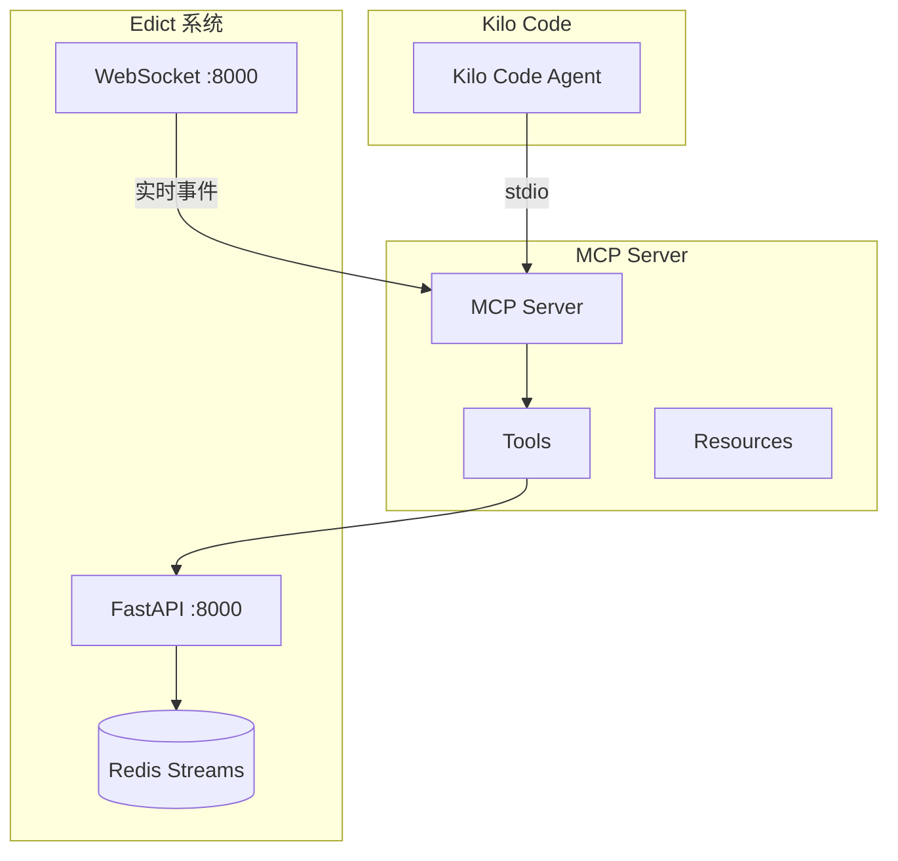

# Edict 项目综合代码分析报告与 MCP 集成实施规划

## 一、代码分析总结

### 1.1 系统架构概览

Edict 是一个基于中国古代"三省六部"制度设计的 AI Agent 协作平台，采用**事件驱动架构**，核心组件包括：

| 层级 | 组件 | 技术栈 |
|------|------|--------|
| API 层 | FastAPI | Python |
| 服务层 | TaskService + EventBus | Python + Redis Streams |
| Worker 层 | Orchestrator + Dispatcher | Python + asyncio |
| 数据层 | PostgreSQL + Redis | SQLAlchemy + redis-py |
| 前端层 | React + Zustand | TypeScript |

### 1.2 关键发现

#### 发现一：双 API 系统
Edict 实际存在**两套 API**：

| 系统 | 端口 | 存储 | 用途 |
|------|------|------|------|
| FastAPI 后端 | 8000 | PostgreSQL | 核心任务管理 |
| 看板服务器 | 7891 | 文件系统 | 看板 UI + 人工干预 |

#### 发现二：事件驱动架构
基于 **Redis Streams** 的可靠消息总线：
- 消费者组 + ACK 机制保证消息不丢失
- 15+ 种事件类型覆盖任务全生命周期
- Worker 分离设计（编排器 + 派发器）

#### 发现三：状态机定义
11 种任务状态，完整的状态流转规则：
```
Taizi → Zhongshu → Menxia → Assigned → Doing → Review → Done
```
支持阻塞（Blocked）和取消（Cancelled）状态。

#### 发现四：无认证机制
所有 API **均无认证授权保护**，适合内部工具集成场景。

---

## 二、MCP 协议集成方案

### 2.1 集成架构设计

基于代码分析，设计如下 MCP 集成方案：



### 2.2 推荐的集成方式

**方案：HTTP API 调用（简单可靠）**

直接调用 Edict FastAPI 端点，无需修改现有代码：

```python
# MCP Server 核心代码示例
import httpx
from mcp.server import Server

class EdictClient:
    def __init__(self, base_url="http://localhost:8000"):
        self.base_url = base_url
        self.client = httpx.AsyncClient(timeout=30)
    
    async def create_task(self, title: str, description: str = "") -> dict:
        resp = await self.client.post(
            f"{self.base_url}/api/tasks",
            json={
                "title": title,
                "description": description,
                "priority": "中",
                "creator": "mcp-client"
            }
        )
        return resp.json()
    
    async def get_task(self, task_id: str) -> dict:
        resp = await self.client.get(f"{self.base_url}/api/tasks/{task_id}")
        return resp.json()
    
    async def transition_task(self, task_id: str, new_state: str, reason: str = "") -> dict:
        resp = await self.client.post(
            f"{self.base_url}/api/tasks/{task_id}/transition",
            json={
                "new_state": new_state,
                "agent": "mcp-client",
                "reason": reason
            }
        )
        return resp.json()
```

---

## 三、详细实施规划

### 3.1 项目结构

```
kilo-edict-mcp/
├── src/
│   └── edict_mcp/
│       ├── __init__.py
│       ├── server.py           # MCP Server 主入口
│       ├── client.py           # Edict API 客户端
│       ├── models.py           # 数据模型
│       ├── tools/
│       │   ├── __init__.py
│       │   ├── tasks.py        # 任务管理 Tools
│       │   ├── agents.py       # Agent 操作 Tools
│       │   └── events.py       # 事件查询 Tools
│       └── resources/
│           ├── __init__.py
│           └── status.py        # 状态 Resources
├── tests/
├── pyproject.toml
├── README.md
└── Dockerfile
```

### 3.2 实施阶段

#### 阶段一：基础 MCP Server

**目标**：实现任务 CRUD 功能

| 任务 | 描述 | 依赖 |
|------|------|------|
| 1.1 | 创建项目结构和 pyproject.toml | - |
| 1.2 | 实现 EdictClient 类 | FastAPI 端点 |
| 1.3 | 实现数据模型 | task.py, event.py |
| 1.4 | 实现 MCP Tools | create_task, get_task, list_tasks |
| 1.5 | 配置 MCP Server | stdio 传输 |
| 1.6 | 单元测试 | pytest |

#### 阶段二：扩展功能

**目标**：实现完整的功能覆盖

| 任务 | 描述 | 依赖 |
|------|------|------|
| 2.1 | 状态流转 Tool | transition_task |
| 2.2 | 任务派发 Tool | dispatch_task |
| 2.3 | Agent 查询 Tools | list_agents, get_agent |
| 2.4 | 事件查询 Tools | list_events |
| 2.5 | Resources 实现 | task://, agent:// |

#### 阶段三：实时功能

**目标**：实现事件订阅和推送

| 任务 | 描述 | 依赖 |
|------|------|------|
| 3.1 | WebSocket 客户端 | ws 连接 |
| 3.2 | 事件订阅 Tool | subscribe_events |
| 3.3 | 实时状态 Resource | events://task/{id} |

---

## 四、关键 API 端点清单

### 4.1 任务管理

| 端点 | 方法 | 功能 | MCP Tool |
|------|------|------|----------|
| `/api/tasks` | POST | 创建任务 | create_task |
| `/api/tasks` | GET | 任务列表 | list_tasks |
| `/api/tasks/{task_id}` | GET | 任务详情 | get_task |
| `/api/tasks/{task_id}/transition` | POST | 状态流转 | transition_task |
| `/api/tasks/{task_id}/dispatch` | POST | 派发任务 | dispatch_task |
| `/api/tasks/{task_id}/progress` | POST | 添加进度 | add_progress |

### 4.2 Agent 管理

| 端点 | 方法 | 功能 | MCP Tool |
|------|------|------|----------|
| `/api/agents` | GET | Agent 列表 | list_agents |
| `/api/agents/{agent_id}` | GET | Agent 详情 | get_agent |
| `/api/agents/{agent_id}/config` | GET | Agent 配置 | get_agent_config |

### 4.3 事件查询

| 端点 | 方法 | 功能 | MCP Tool |
|------|------|------|----------|
| `/api/events` | GET | 事件列表 | list_events |
| `/api/events/topics` | GET | 事件主题 | list_topics |
| `/api/events/stream-info` | GET | Stream 信息 | get_stream_info |

### 4.4 WebSocket

| 端点 | 用途 | MCP Resource |
|------|------|-------------|
| `/ws/ws` | 全局事件流 | events://system |
| `/ws/task/{task_id}` | 任务事件流 | events://task/{id} |

---

## 五、数据模型映射

### 5.1 Task 模型

```python
class MCPTask(BaseModel):
    id: str                           # 任务 ID
    title: str                       # 标题
    state: str                       # 状态 (Taizi/Zhongshu/...)
    org: str                         # 当前部门
    official: str                    # 责任官员
    now: str                         # 当前进展
    eta: str                         # 预计完成
    priority: str                    # 优先级
    flow_log: List[dict]            # 流转日志
    progress_log: List[dict]        # 进展日志
    todos: List[dict]                # 子任务
    created_at: str                  # 创建时间
    updated_at: str                  # 更新时间
```

### 5.2 TaskState 枚举

```python
class TaskState(str, Enum):
    Taizi = "Taizi"           # 太子分拣
    Zhongshu = "Zhongshu"     # 中书起草
    Menxia = "Menxia"          # 门下审议
    Assigned = "Assigned"       # 已派发
    Next = "Next"              # 待执行
    Doing = "Doing"            # 执行中
    Review = "Review"          # 审查中
    Done = "Done"             # 已完成
    Blocked = "Blocked"        # 已阻塞
    Cancelled = "Cancelled"    # 已取消
    Pending = "Pending"        # 待处理
```

---

## 六、Docker 部署配置

### 6.1 启动 Edict 服务

```bash
# 方式一：Demo 模式（端口 7891）
docker-compose up -d

# 方式二：完整模式（端口 8000 + 3000）
cd edict && docker-compose up -d
```

### 6.2 MCP Server 配置

```json
{
  "mcpServers": {
    "edict": {
      "command": "python",
      "args": ["-m", "edict_mcp"],
      "env": {
        "EDICT_API_URL": "http://localhost:8000"
      }
    }
  }
}
```

---

## 七、验证清单

### 功能验证

- [ ] 创建任务成功
- [ ] 查询任务详情成功
- [ ] 任务列表查询成功
- [ ] 状态流转成功
- [ ] 任务派发成功
- [ ] Agent 列表查询成功

### 集成验证

- [ ] Kilo Code 配置生效
- [ ] Tool 调用成功
- [ ] Resource 访问成功
- [ ] 错误处理正常

---

## 八、参考文档

| 文档 | 说明 |
|------|------|
| `plans/edict_api_analysis_report.md` | API 层详细分析 |
| `plans/edict_models_analysis_report.md` | 数据模型详细分析 |
| `plans/edict_services_analysis_report.md` | 服务层和 Worker 详细分析 |
| `plans/edict_docker_frontend_analysis.md` | Docker 和前端详细分析 |

---

## 九、总结

基于对 Edict 项目所有代码的深入分析，本规划：

1. **完全基于现有代码**：不修改 Edict 源码，只做集成
2. **使用 MCP 标准协议**：符合 Kilo Code 架构
3. **可靠的事件驱动**：利用 Redis Streams 实现
4. **分阶段实施**：从基础功能到高级功能逐步完善
5. **完整测试覆盖**：确保集成稳定性

**下一步**：等待用户确认后开始实施。