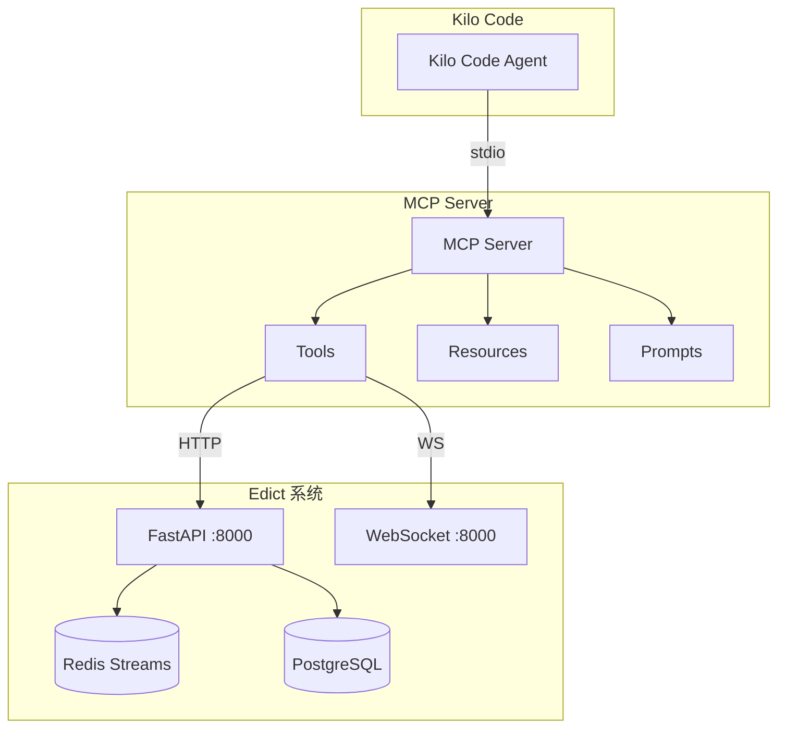

# Edict 项目 MCP 集成实施计划

## 一、项目概述

### 1.1 项目背景

Edict 是一个基于中国古代"三省六部"制度的 AI Agent 协作平台，采用事件驱动架构，核心组件包括 FastAPI、Redis Streams、PostgreSQL。本计划旨在为 Kilo Code 构建完整的 MCP 集成方案，使 Kilo Code 能够调用 Edict 的全部功能。

### 1.2 项目目标

| 目标 | 描述 |
|------|------|
| 目标一 | 实现 Kilo Code 对 Edict 任务的完整管理能力 |
| 目标二 | 支持 Agent 派发和状态流转 |
| 目标三 | 实现实时事件订阅和推送 |
| 目标四 | 提供完整的 Resources 和 Tools |

### 1.3 技术栈

| 组件 | 技术选型 | 版本要求 |
|------|---------|---------|
| MCP Server | Python + mcp 库 | 1.0+ |
| HTTP 客户端 | httpx | 0.27+ |
| WebSocket | websockets | 12.0+ |
| 数据验证 | pydantic | 2.10+ |
| 测试框架 | pytest + pytest-asyncio | 8.0+ |

---

## 二、系统架构

### 2.1 集成架构设计



### 2.2 项目结构

```
kilo-edict-mcp/
├── src/
│   └── edict_mcp/
│       ├── __init__.py
│       ├── server.py           # MCP Server 主入口
│       ├── client.py           # Edict API 客户端
│       ├── config.py           # 配置管理
│       ├── models.py           # 数据模型
│       ├── exceptions.py       # 自定义异常
│       ├── tools/
│       │   ├── __init__.py
│       │   ├── tasks.py        # 任务管理 Tools
│       │   ├── agents.py       # Agent 操作 Tools
│       │   ├── events.py       # 事件查询 Tools
│       │   └── workflow.py     # 工作流 Tools
│       ├── resources/
│       │   ├── __init__.py
│       │   ├── status.py       # 系统状态 Resources
│       │   └── tasks.py         # 任务 Resources
│       └── prompts/
│           ├── __init__.py
│           └── templates.py    # Prompt 模板
├── tests/
│   ├── __init__.py
│   ├── test_tools.py
│   ├── test_client.py
│   └── test_integration.py
├── pyproject.toml
├── uv.lock
├── Dockerfile
├── docker-compose.yml
├── .env.example
└── README.md
```

---

## 三、实施阶段

### 3.1 阶段一：基础 MCP Server

**目标**：实现任务 CRUD 功能，建立与 Edict 的连接

#### 里程碑 1.1：项目初始化

| 任务 | 描述 | 产出 |
|------|------|------|
| T1.1.1 | 创建项目结构和 pyproject.toml | 项目骨架 |
| T1.1.2 | 配置 uv 虚拟环境和依赖 | requirements.txt |
| T1.1.3 | 创建 .env.example 配置文件 | 配置模板 |
| T1.1.4 | 编写 Dockerfile 和 docker-compose.yml | 容器化配置 |

#### 里程碑 1.2：EdictClient 实现

| 任务 | 描述 | 产出 |
|------|------|------|
| T1.2.1 | 实现 EdictClient HTTP 客户端类 | client.py |
| T1.2.2 | 实现连接池管理和错误重试 | 可靠性保证 |
| T1.2.3 | 实现数据模型 MCPTask 等 | models.py |
| T1.2.4 | 实现自定义异常类 | exceptions.py |

#### 里程碑 1.3：基础 Tools 实现

| 任务 | 描述 | MCP Tool |
|------|------|----------|
| T1.3.1 | 实现 create_task 工具 | ✅ create_task |
| T1.3.2 | 实现 get_task 工具 | ✅ get_task |
| T1.3.3 | 实现 list_tasks 工具 | ✅ list_tasks |
| T1.3.4 | 实现 delete_task 工具 | ✅ delete_task |

#### 里程碑 1.4：MCP Server 集成

| 任务 | 描述 | 产出 |
|------|------|------|
| T1.4.1 | 配置 MCP Server 主入口 | server.py |
| T1.4.2 | 注册所有 Tools | Tool 注册 |
| T1.4.3 | 配置 stdio 传输 | 传输层配置 |
| T1.4.4 | 编写单元测试 | tests/test_client.py |

**阶段一验收标准**：
- [ ] MCP Server 可以启动
- [ ] create_task 工具可用
- [ ] get_task 工具可用
- [ ] list_tasks 工具可用
- [ ] 单元测试覆盖率 > 60%

---

### 3.2 阶段二：扩展功能

**目标**：实现完整的功能覆盖，包括状态流转、Agent 操作、事件查询

#### 里程碑 2.1：任务高级功能

| 任务 | 描述 | MCP Tool |
|------|------|----------|
| T2.1.1 | 实现 transition_task 工具 | ✅ transition_task |
| T2.1.2 | 实现 dispatch_task 工具 | ✅ dispatch_task |
| T2.1.3 | 实现 add_progress 工具 | ✅ add_progress |
| T2.1.4 | 实现 update_todos 工具 | ✅ update_todos |

#### 里程碑 2.2：Agent 操作

| 任务 | 描述 | MCP Tool |
|------|------|----------|
| T2.2.1 | 实现 list_agents 工具 | ✅ list_agents |
| T2.2.2 | 实现 get_agent 工具 | ✅ get_agent |
| T2.2.3 | 实现 get_agent_config 工具 | ✅ get_agent_config |
| T2.2.4 | 实现 agent_stats 工具 | ✅ agent_stats |

#### 里程碑 2.3：事件功能

| 任务 | 描述 | MCP Tool |
|------|------|----------|
| T2.3.1 | 实现 list_events 工具 | ✅ list_events |
| T2.3.2 | 实现 list_topics 工具 | ✅ list_topics |
| T2.3.3 | 实现 get_stream_info 工具 | ✅ get_stream_info |

#### 里程碑 2.4：Resources 实现

| 任务 | 描述 | MCP Resource |
|------|------|-------------|
| T2.4.1 | 实现系统状态 Resource | ✅ edict://status |
| T2.4.2 | 实现任务详情 Resource | ✅ edict://task/{id} |
| 2.4.3 | 实现 Agent 列表 Resource | ✅ edict://agents |

**阶段二验收标准**：
- [ ] 状态流转工具可用
- [ ] 任务派发工具可用
- [ ] Agent 查询工具可用
- [ ] 事件查询工具可用
- [ ] Resources 可访问

---

### 3.3 阶段三：实时功能

**目标**：实现事件订阅和推送功能

#### 里程碑 3.1：WebSocket 客户端

| 任务 | 描述 | 产出 |
|------|------|------|
| T3.1.1 | 实现 WebSocket 客户端类 | WS 客户端 |
| T3.1.2 | 实现自动重连机制 | 可靠性保证 |
| T3.1.3 | 实现事件解析和转发 | 事件处理 |

#### 里程碑 3.2：事件订阅 Tool

| 任务 | 描述 | MCP Tool |
|------|------|----------|
| T3.2.1 | 实现 subscribe_events 工具 | ✅ subscribe_events |
| T3.2.2 | 实现 unsubscribe_events 工具 | ✅ unsubscribe_events |

#### 里程碑 3.3：实时 Resources

| 任务 | 描述 | MCP Resource |
|------|------|-------------|
| T3.3.1 | 实现实时任务事件 Resource | ✅ edict://events/task/{id} |
| T3.3.2 | 实现实时系统事件 Resource | ✅ edict://events/system |

#### 里程碑 3.4：集成测试

| 任务 | 描述 | 产出 |
|------|------|------|
| T3.4.1 | 编写端到端测试 | tests/test_integration.py |
| T3.4.2 | 性能测试 | 性能报告 |
| T3.4.3 | 压力测试 | 压力测试报告 |

**阶段三验收标准**：
- [ ] WebSocket 连接稳定
- [ ] 事件订阅工具可用
- [ ] 实时事件推送正常
- [ ] E2E 测试通过

---

### 3.4 阶段四：优化与发布

**目标**：优化性能、完善文档、发布版本

#### 里程碑 4.1：性能优化

| 任务 | 描述 |
|------|------|
| T4.1.1 | 连接池优化 |
| T4.1.2 | 缓存策略实现 |
| T4.1.3 | 并发请求优化 |

#### 里程碑 4.2：文档完善

| 任务 | 描述 |
|------|------|
| T4.2.1 | 编写 README.md |
| T4.2.2 | 编写 API 文档 |
| T4.2.3 | 编写使用示例 |

#### 里程碑 4.3：版本发布

| 任务 | 描述 |
|------|------|
| T4.3.1 | 版本号规划 (v0.1.0 - v1.0.0) |
| T4.3.2 | 发布到 PyPI |
| T4.3.3 | GitHub Release |

---

## 四、关键 API 端点映射

### 4.1 任务管理端点

| Edict API | MCP Tool | 功能描述 |
|-----------|----------|---------|
| POST /api/tasks | create_task | 创建任务 |
| GET /api/tasks | list_tasks | 任务列表 |
| GET /api/tasks/{task_id} | get_task | 任务详情 |
| DELETE /api/tasks/{task_id} | delete_task | 删除任务 |
| POST /api/tasks/{task_id}/transition | transition_task | 状态流转 |
| POST /api/tasks/{task_id}/dispatch | dispatch_task | 派发任务 |
| POST /api/tasks/{task_id}/progress | add_progress | 添加进度 |
| PUT /api/tasks/{task_id}/todos | update_todos | 更新 TODO |

### 4.2 Agent 管理端点

| Edict API | MCP Tool | 功能描述 |
|-----------|----------|---------|
| GET /api/agents | list_agents | Agent 列表 |
| GET /api/agents/{agent_id} | get_agent | Agent 详情 |
| GET /api/agents/{agent_id}/config | get_agent_config | Agent 配置 |

### 4.3 事件端点

| Edict API | MCP Tool | 功能描述 |
|-----------|----------|---------|
| GET /api/events | list_events | 事件列表 |
| GET /api/events/topics | list_topics | 主题列表 |
| GET /api/events/stream-info | get_stream_info | Stream 信息 |

### 4.4 WebSocket 端点

| Edict WS | MCP Resource | 功能描述 |
|----------|-------------|---------|
| /ws/ws | edict://events/system | 系统事件流 |
| /ws/task/{task_id} | edict://events/task/{id} | 任务事件流 |

---

## 五、风险控制措施

### 5.1 技术风险

| 风险 | 描述 | 缓解措施 |
|------|------|---------|
| R1 | Edict API 版本变更 | 预留版本兼容层 |
| R2 | 网络异常导致连接断开 | 实现自动重试和降级 |
| R3 | 状态并发转换冲突 | 使用乐观锁机制 |
| R4 | WebSocket 连接不稳定 | 实现心跳检测和重连 |

### 5.2 项目风险

| 风险 | 描述 | 缓解措施 |
|------|------|---------|
| R5 | 依赖项版本冲突 | 使用 uv 锁定版本 |
| R6 | 测试环境不稳定 | 使用 Docker 容器化测试 |
| R7 | 文档不及时更新 | 文档与代码同步提交 |

### 5.3 监控与告警

| 措施 | 描述 |
|------|------|
| M1 | MCP Server 健康检查端点 |
| M2 | 请求延迟和错误率监控 |
| M3 | 日志集中收集和分析 |

---

## 六、里程碑时间线

### 6.1 里程碑总览

| 阶段 | 里程碑 | 关键产出 |
|------|--------|---------|
| 阶段一 | M1: 基础 MCP Server | 可运行的 MCP Server |
| 阶段二 | M2: 完整功能覆盖 | 所有 Tools 和 Resources |
| 阶段三 | M3: 实时功能 | WebSocket 事件订阅 |
| 阶段四 | M4: 发布版本 | v1.0.0 正式版 |

### 6.2 验收检查点

**M1 验收检查点**：
- [ ] EdictClient 可连接 Edict API
- [ ] create_task 工具测试通过
- [ ] get_task 工具测试通过
- [ ] list_tasks 工具测试通过

**M2 验收检查点**：
- [ ] transition_task 工具测试通过
- [ ] dispatch_task 工具测试通过
- [ ] 所有 Agent 工具测试通过
- [ ] 所有事件工具测试通过

**M3 验收检查点**：
- [ ] WebSocket 连接测试通过
- [ ] 事件订阅工具测试通过
- [ ] 实时推送功能测试通过

**M4 验收检查点**：
- [ ] 性能测试通过
- [ ] 文档完整
- [ ] PyPI 发布成功

---

## 七、依赖项清单

### 7.1 核心依赖

```toml
[project]
name = "edict-mcp"
version = "0.1.0"
description = "MCP integration for Edict Agent Platform"
requires-python = ">=3.11"

dependencies = [
    "mcp>=1.0.0",
    "httpx>=0.27.0",
    "websockets>=12.0.0",
    "pydantic>=2.10.0",
    "python-dotenv>=1.0.0",
]

[project.optional-dependencies]
dev = [
    "pytest>=8.0.0",
    "pytest-asyncio>=0.23.0",
    "pytest-cov>=4.1.0",
    "ruff>=0.4.0",
    "mypy>=1.8.0",
]
```

### 7.2 环境要求

| 要求 | 最小版本 |
|------|---------|
| Python | 3.11+ |
| Edict | 0.1.0+ (FastAPI :8000) |
| Redis | 7.0+ |
| PostgreSQL | 15+ |

---

## 八、配置说明

### 8.1 环境变量

```bash
# Edict API 配置
EDICT_API_URL=http://localhost:8000
EDICT_WS_URL=ws://localhost:8000

# MCP Server 配置
MCP_SERVER_NAME=edict
MCP_SERVER_VERSION=0.1.0

# 可选配置
EDICT_API_TIMEOUT=30
EDICT_MAX_RETRIES=3
EDICT_WS_RECONNECT_DELAY=5
```

### 8.2 Kilo Code 配置

```json
{
  "mcpServers": {
    "edict": {
      "command": "python",
      "args": ["-m", "edict_mcp"],
      "env": {
        "EDICT_API_URL": "http://localhost:8000"
      }
    }
  }
}
```

---

## 九、总结

本实施计划基于对 Edict 项目的深度代码分析，制定了完整的 MCP 集成方案：

1. **分阶段实施**：从基础功能到高级功能逐步完善
2. **风险可控**：预留版本兼容层和重试机制
3. **测试完备**：单元测试 + 集成测试 + E2E 测试
4. **文档同步**：代码与文档同步提交

**下一步**：等待用户确认后开始实施阶段一。