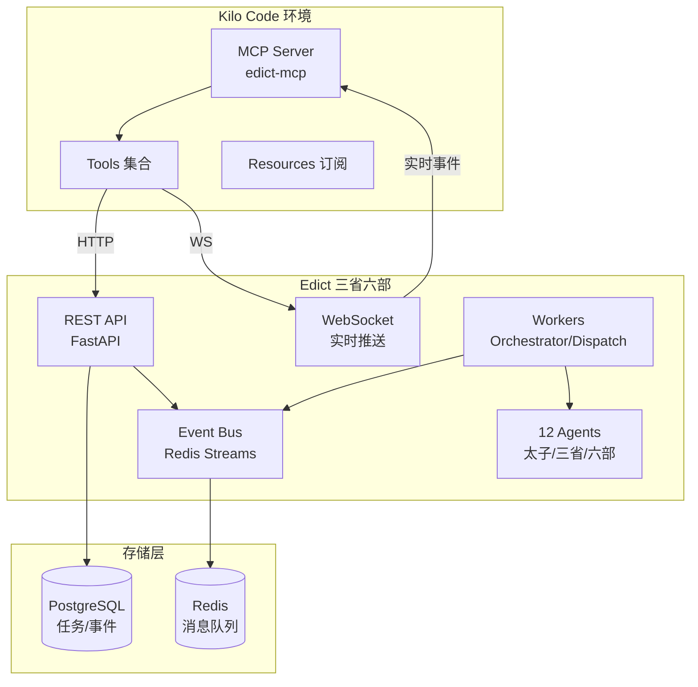
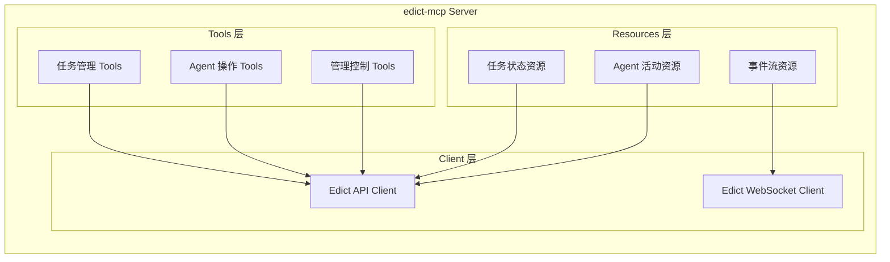

# Kilo Code + Edict 集成实施计划

## 1. 项目目标

构建一个 Kilo Code MCP Server，使其能够调用 Edict "三省六部" AI Agent 协作系统的全部功能，实现：

- **任务管理**：通过 Kilo Code 创建、查询、管理 Edict 任务
- **工作流协作**：Kilo Code 作为特殊 Agent 参与三省六部流转
- **实时监控**：在 Kilo Code 中查看任务状态、Agent 活动、执行进度
- **智能调度**：利用 Edict 的多 Agent 协作能力处理复杂任务

---

## 2. 集成架构设计

### 2.1 整体架构



### 2.2 MCP Server 架构



---

## 3. 实施阶段规划

### 阶段一：基础 MCP Server (MVP)
**目标**：实现核心的任务管理功能，能够通过 Kilo Code 创建和追踪任务

**核心功能**：
- 任务 CRUD 操作
- 任务状态查询
- 基础错误处理

### 阶段二：工作流集成
**目标**：Kilo Code 能够作为 Agent 参与 Edict 工作流

**核心功能**：
- 任务状态流转控制
- Agent 身份模拟
- 工作流事件监听

### 阶段三：实时监控与高级功能
**目标**：完整的实时监控和高级管理能力

**核心功能**：
- WebSocket 实时事件推送
- Agent 健康监控
- 批量操作和调度
- 奏折归档查询

---

## 4. 详细任务清单

### 阶段一：基础 MCP Server

#### 4.1.1 项目初始化
- [ ] 创建 `kilo-edict-mcp` 项目目录
- [ ] 初始化 Python 项目（pyproject.toml）
- [ ] 添加依赖：`mcp`, `httpx`, `websockets`, `pydantic`
- [ ] 创建基础目录结构：
  ```
  kilo-edict-mcp/
  ├── src/
  │   └── edict_mcp/
  │       ├── __init__.py
  │       ├── server.py          # MCP Server 主入口
  │       ├── client/
  │       │   ├── __init__.py
  │       │   ├── api.py         # REST API 客户端
  │       │   └── websocket.py   # WebSocket 客户端
  │       ├── tools/
  │       │   ├── __init__.py
  │       │   ├── tasks.py       # 任务管理 Tools
  │       │   ├── agents.py      # Agent 操作 Tools
  │       │   └── admin.py       # 管理 Tools
  │       ├── resources/
  │       │   ├── __init__.py
  │       │   ├── tasks.py       # 任务 Resources
  │       │   └── agents.py      # Agent Resources
  │       └── models/
  │           ├── __init__.py
  │           ├── task.py        # Task 数据模型
  │           ├── agent.py       # Agent 数据模型
  │           └── event.py       # Event 数据模型
  ├── tests/
  ├── README.md
  └── pyproject.toml
  ```

#### 4.1.2 Edict API 客户端
- [ ] 实现 `EdictAPIClient` 类
- [ ] 封装基础 HTTP 方法（GET/POST/PUT/DELETE）
- [ ] 实现错误处理和重试机制
- [ ] 添加请求/响应日志

#### 4.1.3 数据模型定义
- [ ] `Task` 模型（对应 Edict Task 表）
- [ ] `TaskState` 枚举（Taizi/Zhongshu/Menxia/Assigned/Doing/Review/Done/Blocked）
- [ ] `Agent` 模型（Agent 配置和状态）
- [ ] `Event` 模型（事件结构）
- [ ] Pydantic 验证规则

#### 4.1.4 任务管理 Tools
- [ ] `create_task` - 创建新任务
  ```python
  @mcp.tool()
  async def create_task(
      title: str,
      description: str = "",
      priority: str = "normal",
      context: dict = None
  ) -> Task:
      """创建一个新的 Edict 任务，进入太子分拣阶段"""
  ```

- [ ] `get_task` - 查询任务详情
  ```python
  @mcp.tool()
  async def get_task(task_id: str) -> Task:
      """获取任务详细信息、当前状态、流转历史"""
  ```

- [ ] `list_tasks` - 列出任务
  ```python
  @mcp.tool()
  async def list_tasks(
      state: str = None,
      agent: str = None,
      limit: int = 20
  ) -> list[Task]:
      """按条件查询任务列表"""
  ```

- [ ] `cancel_task` - 取消任务
  ```python
  @mcp.tool()
  async def cancel_task(task_id: str, reason: str = "") -> bool:
      """取消指定任务"""
  ```

#### 4.1.5 MCP Server 主入口
- [ ] 实现 `EdictMCPServer` 类
- [ ] 注册所有 Tools
- [ ] 配置 Server 参数（名称、版本）
- [ ] 实现 `main()` 启动函数
- [ ] 添加命令行参数解析（--edict-url, --port）

#### 4.1.6 测试和文档
- [ ] 编写单元测试（mock Edict API）
- [ ] 编写集成测试（需要 Edict 环境）
- [ ] 编写 README（安装、配置、使用）
- [ ] 编写示例 Prompt

---

### 阶段二：工作流集成

#### 4.2.1 状态流转 Tools
- [ ] `transition_task` - 状态流转
  ```python
  @mcp.tool()
  async def transition_task(
      task_id: str,
      to_state: str,
      remark: str = ""
  ) -> Task:
      """手动推进任务状态（如：门下省封驳后退回中书省）"""
  ```

- [ ] `dispatch_task` - 手动派发
  ```python
  @mcp.tool()
  async def dispatch_task(
      task_id: str,
      to_agent: str,
      instructions: str = ""
  ) -> bool:
      """将任务派发给指定 Agent"""
  ```

#### 4.2.2 Agent 操作 Tools
- [ ] `list_agents` - 列出所有 Agent
  ```python
  @mcp.tool()
  async def list_agents() -> list[Agent]:
      """获取所有可用的 Agent 列表及其状态"""
  ```

- [ ] `get_agent_status` - 查询 Agent 状态
  ```python
  @mcp.tool()
  async def get_agent_status(agent_id: str) -> Agent:
      """获取指定 Agent 的详细状态、Skills、最近活动"""
  ```

- [ ] `wake_agent` - 唤醒 Agent
  ```python
  @mcp.tool()
  async def wake_agent(agent_id: str) -> bool:
      """唤醒处于休眠状态的 Agent"""
  ```

#### 4.2.3 Resources 实现
- [ ] `task://{task_id}` - 任务状态资源
  ```python
  @mcp.resource("task://{task_id}")
  async def get_task_resource(task_id: str) -> str:
      """以可读格式返回任务详情"""
  ```

- [ ] `agent://{agent_id}` - Agent 状态资源
  ```python
  @mcp.resource("agent://{agent_id}")
  async def get_agent_resource(agent_id: str) -> str:
      """返回 Agent 配置和实时状态"""
  ```

- [ ] `edict://dashboard` - 看板概览资源
  ```python
  @mcp.resource("edict://dashboard")
  async def get_dashboard() -> str:
      """返回整体系统状态、任务统计、Agent 活跃度"""
  ```

#### 4.2.4 工作流 Prompts
- [ ] `create_edict_workflow` - 创建工作流 Prompt
  ```
  你正在使用 Edict 三省六部系统处理任务。
  
  系统包含以下 Agent：
  - 太子：消息分拣、任务创建
  - 中书省：方案起草、规划决策
  - 门下省：方案审议、质量把关
  - 尚书省：任务调度、派发六部
  - 六部：工/礼/户/兵/刑/吏 - 专项执行
  
  工作流程：
  1. 使用 create_task 创建任务 → 进入太子分拣
  2. 太子处理后会转发给中书省起草方案
  3. 中书省提交门下省审议
  4. 门下省准奏后转尚书省派发
  5. 尚书省协调六部执行
  6. 完成后返回结果
  
  可用命令：
  - create_task: 创建新任务
  - get_task: 查看任务详情
  - list_tasks: 列出任务
  - transition_task: 状态流转（如需要人工干预）
  ```

---

### 阶段三：实时监控与高级功能

#### 4.3.1 WebSocket 实时订阅
- [ ] 实现 `EdictWebSocketClient` 类
- [ ] 实现自动重连机制
- [ ] 实现事件缓冲和去重
- [ ] 添加心跳检测

- [ ] `subscribe_task_events` - 订阅任务事件
  ```python
  @mcp.tool()
  async def subscribe_task_events(task_id: str) -> str:
      """订阅指定任务的实时事件流，返回订阅 ID"""
  ```

- [ ] `unsubscribe_events` - 取消订阅
  ```python
  @mcp.tool()
  async def unsubscribe_events(subscription_id: str) -> bool:
      """取消事件订阅"""
  ```

#### 4.3.2 实时 Resources
- [ ] `events://task/{task_id}` - 任务事件流
  ```python
  @mcp.resource("events://task/{task_id}")
  async def get_task_events(task_id: str) -> str:
      """返回任务的实时事件流（WebSocket 订阅）"""
  ```

- [ ] `events://system` - 系统事件流
  ```python
  @mcp.resource("events://system")
  async def get_system_events() -> str:
      """返回系统级事件流（所有任务、Agent 活动）"""
  ```

#### 4.3.3 高级管理 Tools
- [ ] `archive_task` - 归档任务（奏折）
  ```python
  @mcp.tool()
  async def archive_task(task_id: str) -> bool:
      """将完成的任务归档为奏折"""
  ```

- [ ] `get_memorials` - 查询奏折
  ```python
  @mcp.tool()
  async def get_memorials(
      start_date: str = None,
      end_date: str = None,
      agent: str = None
  ) -> list[dict]:
      """查询已归档的奏折（历史任务）"""
  ```

- [ ] `retry_task` - 重试任务
  ```python
  @mcp.tool()
  async def retry_task(task_id: str) -> bool:
      """重新执行失败或停滞的任务"""
  ```

- [ ] `escalate_task` - 升级任务
  ```python
  @mcp.tool()
  async def escalate_task(
      task_id: str,
      to_agent: str,
      reason: str = ""
  ) -> bool:
      """将任务升级给更高级别的 Agent 处理"""
  ```

#### 4.3.4 批量操作 Tools
- [ ] `batch_create_tasks` - 批量创建任务
  ```python
  @mcp.tool()
  async def batch_create_tasks(tasks: list[dict]) -> list[Task]:
      """批量创建多个任务"""
  ```

- [ ] `batch_cancel_tasks` - 批量取消
  ```python
  @mcp.tool()
  async def batch_cancel_tasks(task_ids: list[str], reason: str = "") -> bool:
      """批量取消多个任务"""
  ```

#### 4.3.5 配置和优化
- [ ] 实现连接池管理
- [ ] 添加请求限流和熔断
- [ ] 实现缓存机制（减少重复查询）
- [ ] 添加性能监控指标
- [ ] 完善错误处理和用户提示

---

## 5. MCP Server 配置

### 5.1 配置方式

**方式一：环境变量**
```bash
export EDICT_API_URL="http://localhost:7891"
export EDICT_WS_URL="ws://localhost:7891/ws"
export EDICT_TIMEOUT="30"
export EDICT_MAX_RETRIES="3"
```

**方式二：配置文件**
```json
{
  "edict": {
    "api_url": "http://localhost:7891",
    "ws_url": "ws://localhost:7891/ws",
    "timeout": 30,
    "max_retries": 3,
    "auto_reconnect": true
  },
  "mcp": {
    "server_name": "edict-mcp",
    "version": "1.0.0"
  }
}
```

**方式三：命令行参数**
```bash
python -m edict_mcp --edict-url http://localhost:7891 --port 8080
```

### 5.2 Kilo Code 配置

在 Kilo Code 的 MCP 配置中添加：

```json
{
  "mcpServers": {
    "edict": {
      "command": "python",
      "args": ["-m", "edict_mcp", "--edict-url", "http://localhost:7891"],
      "env": {
        "EDICT_API_URL": "http://localhost:7891"
      }
    }
  }
}
```

---

## 6. 使用示例

### 6.1 基础任务创建

```
用户：帮我分析这个代码仓库的安全问题

Kilo Code：我来通过 Edict 系统为您处理这个任务。

[调用 create_task]
- title: "分析代码仓库安全问题"
- description: "对指定代码仓库进行全面的安全审计，包括：
  1. 依赖漏洞扫描
  2. 代码安全漏洞检测
  3. 敏感信息泄露检查
  4. 输出安全审计报告"
- priority: "high"

已创建任务 EDCT-20260310-001，已进入太子分拣阶段...

[等待太子处理...]
太子已将任务转交中书省规划...

[中书省起草方案...]
中书省已制定执行方案，提交门下省审议...

[门下省审议...]
门下省已准奏，转尚书省派发...

[尚书省派发六部...]
- 刑部：执行安全审计
- 礼部：编写审计报告

[刑部执行中...]
发现 3 个高危漏洞，2 个中危漏洞...

[礼部编写报告...]
审计报告已完成

[尚书省汇总回奏...]
任务已完成！
```

### 6.2 实时监控

```
用户：查看任务 EDCT-20260310-001 的最新进展

Kilo Code：
[调用 get_task]

任务状态：Doing（执行中）
当前部门：刑部
责任官员：xingbu

最近进展：
- 10:30 刑部开始安全扫描
- 10:35 发现依赖漏洞：lodash CVE-2024-XXXX
- 10:40 完成代码静态分析

子任务进度：
- [x] 依赖扫描 (100%)
- [x] 代码分析 (100%)
- [ ] 报告生成 (0%)

预计完成时间：11:00
```

### 6.3 人工干预

```
用户：门下省封驳了方案，我需要查看并修改

Kilo Code：
[调用 get_task 查看封驳原因]

门下省封驳原因：
"方案中缺少对第三方依赖的审查环节，建议补充"

我来帮您修改方案并重新提交...

[调用 transition_task]
将任务从 Menxia 流转回 Zhongshu...

已退回中书省修改方案...
```

---

## 7. 风险提示和注意事项

### 7.1 技术风险

1. **Edict API 兼容性**
   - Edict 项目还在演进中，API 可能变化
   - 建议固定 Edict 版本或实现版本适配层

2. **WebSocket 稳定性**
   - 网络波动可能导致连接断开
   - 需要实现完善的断线重连机制

3. **事件顺序**
   - 分布式事件可能存在乱序
   - 客户端需要根据时间戳排序

### 7.2 使用限制

1. **并发限制**
   - Edict 的 Worker 有并发限制
   - 批量操作需要控制并发数

2. **状态流转约束**
   - 必须遵循 Edict 定义的状态机
   - 非法流转会被拒绝

3. **Agent 可用性**
   - 某些 Agent 可能处于离线状态
   - 需要检查 Agent 状态后再派发

---

## 8. 验收标准

### 8.1 功能验收

| 功能 | 验收标准 | 优先级 |
|------|---------|--------|
| 任务创建 | 成功创建任务并返回正确 ID | P0 |
| 任务查询 | 能查询任务详情、列表、历史 | P0 |
| 状态流转 | 能正确推进任务状态 | P1 |
| Agent 查询 | 能列出和查询 Agent 状态 | P1 |
| 实时监控 | WebSocket 事件正常接收 | P2 |
| 批量操作 | 支持批量创建/取消任务 | P2 |
| 奏折查询 | 能查询归档任务 | P3 |

### 8.2 质量验收

- [ ] 单元测试覆盖率 > 80%
- [ ] 集成测试通过（需要 Edict 环境）
- [ ] 代码符合 PEP8 规范
- [ ] 文档完整（README + API 文档）
- [ ] 示例代码可运行

---

## 9. 后续扩展方向

1. **技能管理**：支持通过 Kilo Code 为 Agent 添加 Skills
2. **模型切换**：支持切换 Agent 使用的 LLM 模型
3. **模板库**：支持使用圣旨模板创建任务
4. **统计报表**：集成官员统计和 Token 消耗分析
5. **移动端适配**：优化移动端的交互体验

---

## 10. 附录

### 10.1 参考资料

- [Edict 架构分析](./edict_architecture_analysis.md)
- [Edict README](../README.md)
- [MCP 协议文档](https://modelcontextprotocol.io/)

### 10.2 相关文件

- Edict API 定义：`edict/backend/app/api/`
- Edict 数据模型：`edict/backend/app/models/`
- Edict 事件总线：`edict/backend/app/services/event_bus.py`
