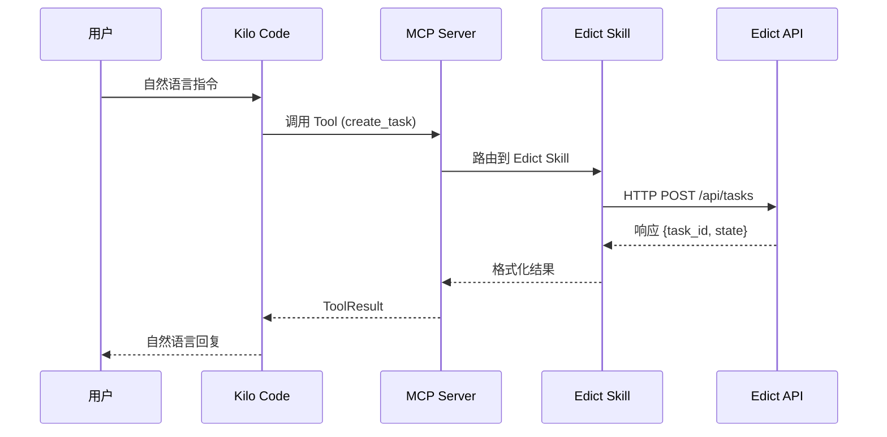
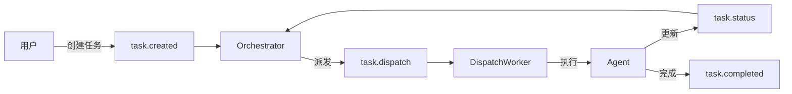

# Skill 双边交互机制详解

## MCP 协议中的 Skill 角色

在 Kilo Code 架构中，**Skill** 是一个可被 Kilo Code 调用的小型工具/服务。双边交互遵循 **MCP (Model Context Protocol)** 协议。



---

## Skill 的两种交互模式

### 模式一：同步请求-响应（Reactive）

这是最常用的模式：Kilo Code 调用 Skill，Skill 执行后返回结果。

```
Kilo Code → Skill → Edict API → 返回结果 → Kilo Code
```

**示例**：
```python
# Kilo Code 调用
result = await edict.create_task(title="分析代码安全性")

# 内部流程
# 1. MCP Server 接收调用
# 2. Edict Skill 执行 HTTP 请求
# 3. 返回格式化结果
```

### 模式二：事件驱动（Proactive）

Edict 端发生事件时，主动推送到 Skill（需要 WebSocket 或轮询）。

```
Edict (事件) → Skill 订阅 → 通知 Kilo Code
```

---

## Edict 事件系统

Edict 有完整的事件驱动架构，基于 **Redis Streams**：

### 事件类型

| 事件 | 说明 | 用途 |
|------|------|------|
| `task.created` | 任务创建 | 触发后续流程 |
| `task.status` | 状态变更 | 更新看板 |
| `task.dispatch` | 派发 Agent | 触发执行 |
| `task.completed` | 任务完成 | 回奏结果 |
| `task.stalled` | 任务停滞 | 触发重试 |
| `agent.thoughts` | Agent 思考 | 实时展示 |
| `agent.heartbeat` | Agent 心跳 | 健康检测 |

### 事件流转



---

## Skill 如何接收 Edict 事件

### 方案一：WebSocket 订阅（推荐）

Edict FastAPI 提供 WebSocket 端点：

```python
# 订阅任务事件
async with websockets.connect("ws://localhost:8000/ws/task/{task_id}") as ws:
    async for message in ws:
        event = json.loads(message)
        # 处理事件
        # 可以通知 Kilo Code
```

### 方案二：轮询 API

定期查询任务状态：

```python
async def poll_task_status(task_id: str):
    while True:
        resp = await client.get(f"/api/tasks/{task_id}")
        task = resp.json()
        
        if task["state"] == "Done":
            # 任务完成，通知 Kilo Code
            break
        
        await asyncio.sleep(10)  # 10秒轮询
```

### 方案三：Redis Stream 消费

直接消费 Redis Stream：

```python
import redis.asyncio as redis

async def consume_events():
    r = await redis.from_url("redis://localhost:6379")
    
    while True:
        # 阻塞读取
        messages = await r.xread({"task.status": "0"}, count=1, block=5000)
        
        for stream, msgs in messages:
            for msg_id, data in msgs:
                event = json.loads(data[b"payload"])
                # 处理事件
```

---

## 完整交互流程示例

### 场景：Kilo Code 创建任务并跟踪进度

```python
# ========== Kilo Code 侧 ==========

# 1. 创建任务
task_result = await edict.create_task(
    title="分析项目安全漏洞",
    description="使用安全扫描工具检查依赖漏洞"
)

# task_result = {
#     "id": "task-uuid",
#     "state": "Taizi",
#     "message": "任务已创建"
# }

# 2. 跟踪进度（轮询）
async def track_task(task_id: str):
    while True:
        task = await edict.get_task(task_id)
        
        if task["state"] == "Done":
            return task["output"]
        elif task["state"] == "Blocked":
            raise Exception(f"任务阻塞: {task.get('block')}")
        
        await asyncio.sleep(15)

# ========== Edict 侧 ==========

# 事件流：
# 1. task.created → 太子分拣
# 2. 太子 → 中书省 (state: Zhongshu)
# 3. 中书省起草方案 → 门下省 (state: Menxia)
# 4. 门下省准奏 → 尚书省 (state: Assigned)
# 5. 尚书省派发 → 六部 (state: Doing)
# 6. 六部完成 → 审查 (state: Review)
# 7. 审查通过 → 完成 (state: Done)
```

---

## Skill 通知 Kilo Code 的方式

### 方式一：Tool 返回时同步通知

Skill 执行完成后，直接在返回值中包含状态信息：

```python
async def get_task_status(task_id: str) -> str:
    task = await client.get_task(task_id)
    
    return f"""
📋 任务状态: {task.state}
👤 负责部门: {task.org}
📝 当前进展: {task.now}
📊 子任务进度: {task.progress}%
⏱️ 预计完成: {task.eta}
"""
```

### 方式二：回调（Callback）

Edict 支持配置回调 URL，任务完成时主动通知：

```python
# 创建任务时指定回调
task = await client.create_task(
    title="...",
    callback_url="http://kilo-code-webhook/notify"
)

# Edict 任务完成时发送 POST 回调
# Kilo Code 收到通知后可以进一步处理
```

### 方式三：WebSocket 双向通信（高级）

如果需要真正的双向通信，可以：

1. Skill 启动一个 WebSocket 服务器
2. Edict 通过 WebSocket 推送事件
3. Skill 实时转发给 Kilo Code

```python
# Skill 侧
from aiohttp import web

async def websocket_handler(request):
    ws = web.WebSocketResponse()
    await ws.prepare(request)
    
    # 订阅 Edict 事件
    async with websockets.connect(edict_ws_url) as edict_ws:
        # 转发 Edict 事件到 Kilo Code
        async for msg in edict_ws:
            await ws.send_str(msg.data)
    
    return ws

app = web.Application()
app.router.add_get('/ws', websocket_handler)
```

---

## 总结：双边交互架构

```
┌─────────────────────────────────────────────────────────────┐
│                     Kilo Code                               │
│  ┌─────────────┐    ┌─────────────┐    ┌─────────────┐   │
│  │  User Input  │ →  │  Reasoning  │ →  │   Output    │   │
│  └─────────────┘    └──────┬──────┘    └─────────────┘   │
│                            │                               │
│                     Tools/Resources                         │
└────────────────────────────┼───────────────────────────────┘
                             │
                             ▼
┌─────────────────────────────────────────────────────────────┐
│                    Edict Skill (MCP)                        │
│  ┌─────────────┐    ┌─────────────┐    ┌─────────────┐   │
│  │ MCP Server  │ →  │ API Client  │ →  │   Edict API │   │
│  └─────────────┘    └─────────────┘    └──────┬──────┘   │
│                            │                     │          │
│                     Events (WS/Poll)            │          │
└────────────────────────────────────────────────────────────┘
```

### 关键点

1. **请求方向**：Kilo Code → Skill → Edict API
2. **响应方向**：Edict API → Skill → Kilo Code
3. **事件方向**（可选）：Edict → Skill（通过 WebSocket/轮询）
4. **状态同步**：Skill 负责在两边之间转换格式