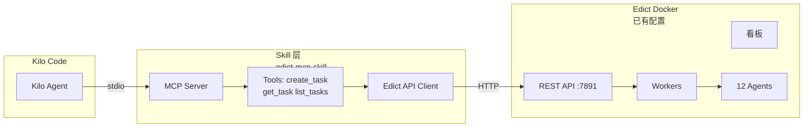

# Skill 集成方案 - 复用 Edict Docker 部署

## 架构概览

利用 Edict **现有**的 Docker 支持，只开发 Skill 集成层：



---

## 复用 Edict Docker

Edict 项目已有 Docker 配置：

### 现有文件
- [`docker-compose.yml`](docker-compose.yml) - 顶层编排
- [`edict/docker-compose.yml`](edict/docker-compose.yml) - 详细服务配置
- [`edict/Dockerfile`](edict/Dockerfile) - 后端镜像
- [`edict/frontend/Dockerfile`](edict/frontend/Dockerfile) - 前端镜像

### 启动 Edict
```bash
# 使用项目自带配置
docker-compose up -d

# 或进入 edict 目录
cd edict && docker-compose up -d
```

### 验证
```bash
curl http://localhost:7891/health
# 预期: {"status": "ok", "version": "2.0.0"}
```

---

## Skill 项目开发

### 项目位置
在 Edict 项目外**独立**创建 Skill 项目（或作为子目录）：
```
edict/                    # 现有 Edict 项目
├── docker-compose.yml    # Edict Docker 配置
├── ...

edict-mcp-skill/          # 新建 Skill 项目
├── src/
├── pyproject.toml
└── README.md
```

### Skill 核心代码

#### 1. 项目初始化
```toml
# pyproject.toml
[project]
name = "edict-mcp-skill"
version = "0.1.0"
dependencies = [
    "mcp>=1.0.0",
    "httpx>=0.27.0",
    "pydantic>=2.0",
]

[project.scripts]
edict-skill = "edict_skill:main"
```

#### 2. Edict 客户端
```python
# client.py
import httpx
from typing import Optional, List
from pydantic import BaseModel
from enum import Enum

class TaskState(str, Enum):
    TAZI = "Taizi"
    ZHONGSHU = "Zhongshu"
    MENXIA = "Menxia"
    ASSIGNED = "Assigned"
    DOING = "Doing"
    REVIEW = "Review"
    DONE = "Done"
    BLOCKED = "Blocked"

class Task(BaseModel):
    id: str
    title: str
    description: str = ""
    state: TaskState
    org: Optional[str] = None
    official: Optional[str] = None

class EdictClient:
    def __init__(self, base_url: str = "http://localhost:7891"):
        self.base_url = base_url.rstrip("/")
        self.client = httpx.AsyncClient(timeout=30)
    
    async def create_task(self, title: str, description: str = "") -> Task:
        resp = await self.client.post(
            f"{self.base_url}/api/tasks",
            json={"title": title, "description": description}
        )
        resp.raise_for_status()
        return Task(**resp.json())
    
    async def get_task(self, task_id: str) -> Task:
        resp = await self.client.get(f"{self.base_url}/api/tasks/{task_id}")
        resp.raise_for_status()
        return Task(**resp.json())
    
    async def list_tasks(self, state: Optional[str] = None, limit: int = 20) -> List[Task]:
        params = {}
        if state:
            params["state"] = state
        if limit:
            params["limit"] = limit
        resp = await self.client.get(f"{self.base_url}/api/tasks", params=params)
        resp.raise_for_status()
        return [Task(**t) for t in resp.json()]
```

#### 3. MCP Server
```python
# server.py
import asyncio
import os
from typing import Sequence
from mcp.server import Server
from mcp.server.stdio import stdio_server
from mcp.types import TextContent, Tool
from client import EdictClient

class EdictSkillServer:
    def __init__(self):
        self.server = Server("edict-skill")
        self.edict_url = os.getenv("EDICT_URL", "http://localhost:7891")
        self.client = EdictClient(self.edict_url)
        self._setup_handlers()
    
    def _setup_handlers(self):
        @self.server.list_tools()
        async def list_tools() -> Sequence[Tool]:
            return [
                Tool(
                    name="create_task",
                    description="在 Edict 三省六部系统中创建新任务",
                    inputSchema={
                        "type": "object",
                        "properties": {
                            "title": {
                                "type": "string",
                                "description": "任务标题"
                            },
                            "description": {
                                "type": "string",
                                "description": "任务详细描述"
                            }
                        },
                        "required": ["title"]
                    }
                ),
                Tool(
                    name="get_task",
                    description="查询任务详情",
                    inputSchema={
                        "type": "object",
                        "properties": {
                            "task_id": {
                                "type": "string",
                                "description": "任务 ID"
                            }
                        },
                        "required": ["task_id"]
                    }
                ),
                Tool(
                    name="list_tasks",
                    description="列出任务",
                    inputSchema={
                        "type": "object",
                        "properties": {
                            "state": {
                                "type": "string",
                                "description": "按状态过滤"
                            },
                            "limit": {
                                "type": "integer",
                                "description": "数量限制"
                            }
                        }
                    }
                )
            ]
        
        @self.server.call_tool()
        async def call_tool(name: str, arguments: dict):
            if name == "create_task":
                task = await self.client.create_task(
                    arguments["title"],
                    arguments.get("description", "")
                )
                return [TextContent(
                    type="text",
                    text=f"""✅ 任务创建成功

📋 任务 ID: {task.id}
📌 标题: {task.title}
📊 状态: {task.state.value}
👤 负责人: {task.official or '待分配'}

任务已进入太子分拣阶段。"""
                )]
            
            elif name == "get_task":
                task = await self.client.get_task(arguments["task_id"])
                return [TextContent(
                    type="text",
                    text=f"""📋 任务详情

ID: {task.id}
标题: {task.title}
状态: {task.state.value}
部门: {task.org or '-'}
负责人: {task.official or '-'}"""
                )]
            
            elif name == "list_tasks":
                tasks = await self.client.list_tasks(
                    arguments.get("state"),
                    arguments.get("limit", 10)
                )
                if not tasks:
                    return [TextContent(type="text", text="暂无任务")]
                
                lines = ["📋 任务列表\n"]
                for t in tasks:
                    lines.append(f"• [{t.state.value:10}] {t.id}: {t.title[:40]}")
                return [TextContent(type="text", text="\n".join(lines))]
            
            else:
                raise ValueError(f"未知工具: {name}")
    
    async def run(self):
        async with stdio_server() as (read_stream, write_stream):
            await self.server.run(
                read_stream,
                write_stream,
                self.server.create_initialization_options()
            )

def main():
    server = EdictSkillServer()
    asyncio.run(server.run())

if __name__ == "__main__":
    main()
```

---

## 快速开始

### 步骤 1：启动 Edict（使用现有 Docker）
```bash
cd edict  # Edict 项目目录
docker-compose up -d

# 验证
curl http://localhost:7891/health
```

### 步骤 2：安装 Skill
```bash
cd edict-mcp-skill
pip install -e .
```

### 步骤 3：配置 Kilo Code
在 Kilo Code 配置中添加：
```json
{
  "mcpServers": {
    "edict": {
      "command": "python",
      "args": ["-m", "edict_skill.server"],
      "env": {
        "EDICT_URL": "http://localhost:7891"
      }
    }
  }
}
```

### 步骤 4：使用
```
用户：创建一个任务分析性能问题
Kilo Code → [edict/create_task]
→ ✅ 任务 EDCT-20260310-001 创建成功

用户：查看这个任务
Kilo Code → [edict/get_task]
→ 状态: Doing, 兵部执行中
```

---

## 扩展功能（可选）

### 添加更多 Tools
```python
# 状态流转
async def transition_task(task_id: str, to_state: str) -> str

# 取消任务
async def cancel_task(task_id: str) -> str

# 列出 Agent
async def list_agents() -> str

# 查询 Agent 状态
async def get_agent_status(agent_id: str) -> str
```

### WebSocket 实时事件
```python
import websockets
import json

async def subscribe_task_events(task_id: str):
    uri = f"ws://localhost:7891/ws/task/{task_id}"
    async with websockets.connect(uri) as ws:
        async for message in ws:
            event = json.loads(message)
            yield event
```

---

## 项目结构建议

```
edict-mcp-skill/              # Skill 项目（独立仓库或子目录）
├── src/
│   └── edict_skill/
│       ├── __init__.py
│       ├── server.py         # MCP Server 入口
│       ├── client.py         # Edict API 客户端
│       └── tools.py          # Tools 实现（可选拆分）
├── tests/
│   ├── test_client.py
│   └── test_server.py
├── pyproject.toml
├── README.md
└── .gitignore
```

---

## 验收标准

- [ ] Edict Docker 正常启动
- [ ] Skill 项目能安装并运行
- [ ] `create_task` 能成功创建任务
- [ ] `get_task` 能查询任务详情
- [ ] `list_tasks` 能列出任务
- [ ] Kilo Code 能成功调用所有 Tools

---

## 下一步

1. 创建 `edict-mcp-skill` 项目目录
2. 实现基础 MCP Server
3. 测试与 Edict Docker 的集成
4. 配置 Kilo Code 并使用

是否需要我开始实施 Skill 项目？