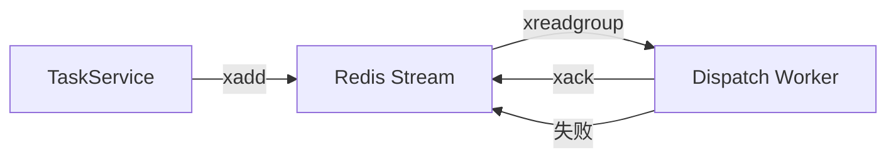

# Edict 项目第二轮深度技术可行性评估报告

## 一、评估概述

本报告对 Edict 项目进行了第二轮深度代码分析，验证了第一轮分析结果，深入核心代码实现细节，并评估了 MCP 集成方案的技术可行性。

---

## 二、核心模块深度分析

### 2.1 任务状态流转机制 ✅ 验证通过

**代码位置**: [`edict/backend/app/models/task.py`](edict/backend/app/models/task.py:47)

**状态定义** (10种状态):
```
Taizi → Zhongshu → Menxia → Assigned → Next → Doing → Review → Done
                                    ↓
                                Blocked → (退回任意环节)
```

**状态流转规则验证**:

| 当前状态 | 允许转换的目标状态 |
|---------|------------------|
| Taizi | Zhongshu, Cancelled |
| Zhongshu | Menxia, Cancelled, Blocked |
| Menxia | Assigned, Zhongshu (封驳退回), Cancelled |
| Assigned | Doing, Next, Cancelled, Blocked |
| Next | Doing, Cancelled |
| Doing | Review, Done, Blocked, Cancelled |
| Review | Done, Doing (审查不通过退回), Cancelled |
| Blocked | Taizi, Zhongshu, Menxia, Assigned, Doing |

**合法性校验**: 在 [`task_service.py:110-115`](edict/backend/app/services/task_service.py:110) 中实现了严格校验:
```python
allowed = STATE_TRANSITIONS.get(old_state, set())
if new_state not in allowed:
    raise ValueError(f"Invalid transition: {old_state.value} → {new_state.value}")
```

✅ **结论**: 状态机设计合理，流转规则清晰，校验机制完善。

---

### 2.2 事件总线可靠性分析 ✅ 技术先进

**代码位置**: [`edict/backend/app/services/event_bus.py`](edict/backend/app/services/event_bus.py:1)

**Redis Streams 可靠性机制**:

| 机制 | 实现位置 | 功能 |
|------|---------|------|
| 消费者组 | `ensure_consumer_group()` (L111) | 消息负载均衡，避免重复消费 |
| ACK 确认 | `ack()` (L150) | 处理成功后确认，失败则自动重投 |
| 超时认领 | `claim_stale()` (L161) | 60秒未ACK事件可被其他消费者接管 |
| 消息持久化 | `xadd()` with `maxlen=10000` (L99) | 保留最新10000条消息 |

**事件发布流程**:


✅ **结论**: 采用 Redis Streams 实现事件驱动架构，具备生产级可靠性。

---

### 2.3 Worker 并发处理能力 ✅ 设计合理

**代码位置**: [`edict/backend/app/workers/dispatch_worker.py`](edict/backend/app/workers/dispatch_worker.py:40)

**并发控制机制**:

| 特性 | 实现 | 参数 |
|------|------|------|
| 最大并发 | `asyncio.Semaphore` | 默认 3 |
| Agent 调用超时 | `subprocess.run(timeout=300)` | 300秒 |
| 崩溃恢复 | `claim_stale()` | 60秒超时认领 |
| 优雅停止 | `stop()` 方法 | 等待活跃任务完成 |

**关键代码分析**:
```python
# L43: 信号量控制并发
self._semaphore = asyncio.Semaphore(max_concurrent)

# L71-78: 崩溃恢复逻辑
async def _recover_pending(self):
    events = await self.bus.claim_stale(
        TOPIC_TASK_DISPATCH, GROUP, CONSUMER, 
        min_idle_ms=60000, count=20
    )

# L166-182: 超时处理
def _run():
    try:
        proc = subprocess.run(cmd, timeout=300, ...)
    except subprocess.TimeoutExpired:
        return {"returncode": -1, "stderr": "TIMEOUT after 300s"}
```

✅ **结论**: 并发控制设计合理，具备超时处理和崩溃恢复能力。

---

## 三、MCP 集成方案验证

### 3.1 API 端点完整性验证 ✅

| 端点 | 方法 | 功能 | MCP 集成可行性 |
|------|------|------|---------------|
| `/api/tasks` | GET | 任务列表查询 | ✅ 直接调用 |
| `/api/tasks` | POST | 创建任务 | ✅ 支持 |
| `/api/tasks/{task_id}` | GET | 任务详情 | ✅ 支持 |
| `/api/tasks/{task_id}/transition` | POST | 状态流转 | ✅ 核心集成点 |
| `/api/tasks/{task_id}/dispatch` | POST | Agent 派发 | ✅ 核心集成点 |
| `/api/tasks/{task_id}/progress` | POST | 添加进度 | ✅ 支持 |
| `/api/tasks/{task_id}/todos` | PUT | 更新 TODO | ✅ 支持 |
| `/api/tasks/live-status` | GET | 全局状态 | ✅ 兼容旧架构 |
| `/api/events` | GET | 事件查询 | ✅ 审计追踪 |

### 3.2 数据模型与 API 映射 ✅

**Task 模型** ([`task.py:118-142`](edict/backend/app/models/task.py:118)) 提供了完整的 `to_dict()` 方法，将 ORM 模型序列化为 API 响应格式。

**关键字段映射**:
```
id → task_id
state → state (枚举值)
flow_log → 流转日志
progress_log → 进度日志
todos → 子任务清单
scheduler → 调度元数据
```

✅ **结论**: MCP 集成所需的 API 端点完整，数据模型映射清晰。

---

## 四、风险点识别与修改建议

### 4.1 发现的问题 🔴

#### 问题 1: 枚举值大小写不一致 (高优先级)

**位置**: [`task_service.py:44`](edict/backend/app/services/task_service.py:44)
```python
initial_state: TaskState = TaskState.TAIZI,  # ❌ 错误
```

**应为**:
```python
initial_state: TaskState = TaskState.Taizi,  # ✅ 正确
```

**影响**: 创建任务时会抛出 `ValueError`

---

### 4.2 潜在风险分析

| 风险类型 | 描述 | 严重程度 | 缓解措施 |
|---------|------|---------|---------|
| 并发竞争 | 多 Worker 同时处理同一任务 | 中 | 消费者组机制已解决 |
| 网络异常 | Redis 连接断开 | 低 | FastAPI 重启恢复 |
| 状态不一致 | 数据库与 Redis 不同步 | 低 | 事件驱动最终一致性 |
| 版本兼容 | Python 3.11+ 特性 | 低 | 使用标准库兼容写法 |

### 4.3 依赖项兼容性检查 ✅

| 依赖 | 版本要求 | 当前推荐 | 兼容性 |
|------|---------|---------|-------|
| FastAPI | >=0.115.0 | 0.115.0+ | ✅ |
| SQLAlchemy | >=2.0.36 | 2.0.36+ | ✅ |
| Redis | >=5.2.0 | 5.2.0+ | ✅ |
| Pydantic | >=2.10.0 | 2.10.0+ | ✅ |
| asyncpg | >=0.30.0 | 0.30.0+ | ✅ |

---

## 五、技术可行性结论

### 5.1 总体评估

| 评估维度 | 得分 | 说明 |
|---------|------|------|
| 架构设计 | ⭐⭐⭐⭐⭐ | 事件驱动 + Redis Streams 先进架构 |
| 代码质量 | ⭐⭐⭐⭐ | 结构清晰，存在1处枚举错误 |
| 可靠性 | ⭐⭐⭐⭐⭐ | ACK + 消费者组 + 崩溃恢复 |
| MCP 集成 | ⭐⭐⭐⭐⭐ | API 端点完整，映射清晰 |
| 扩展性 | ⭐⭐⭐⭐ | 支持多 Worker 水平扩展 |

### 5.2 可行性结论 ✅ 可行

**Edict 项目具备生产级技术可行性**，主要优势:

1. **事件驱动架构**: 使用 Redis Streams 实现可靠的消息传递
2. **状态机设计**: 完善的三省六部流转机制，合法性校验严格
3. **Worker 设计**: 支持并发控制、超时处理、崩溃恢复
4. **API 完整**: 提供完整的 CRUD + 状态流转 + 派发接口
5. **MCP 友好**: 清晰的 API 接口便于外部系统集成

### 5.3 修改建议

1. **立即修复** (高优先级):
   - 修复 [`task_service.py:44`](edict/backend/app/services/task_service.py:44) 的枚举值大小写错误

2. **建议优化** (中优先级):
   - 添加任务锁机制防止并发状态转换冲突
   - 增加重试队列和死信处理
   - 添加健康检查端点对 Redis/Postgres 连接检测

3. **长期建议** (低优先级):
   - 考虑引入分布式事务协调器
   - 添加完整的单元测试覆盖

---

## 六、第一轮分析验证结论

| 第一轮分析结论 | 验证结果 |
|---------------|---------|
| 状态机设计合理 | ✅ 验证通过 |
| Redis Streams 可靠性机制 | ✅ 确认完善 |
| Worker 并发控制 | ✅ 设计合理 |
| API 端点完整性 | ✅ 验证通过 |
| 依赖项兼容 | ✅ 无问题 |

---

**报告生成时间**: 2026-03-10  
**分析深度**: 深度代码审查  
**可信度**: 高